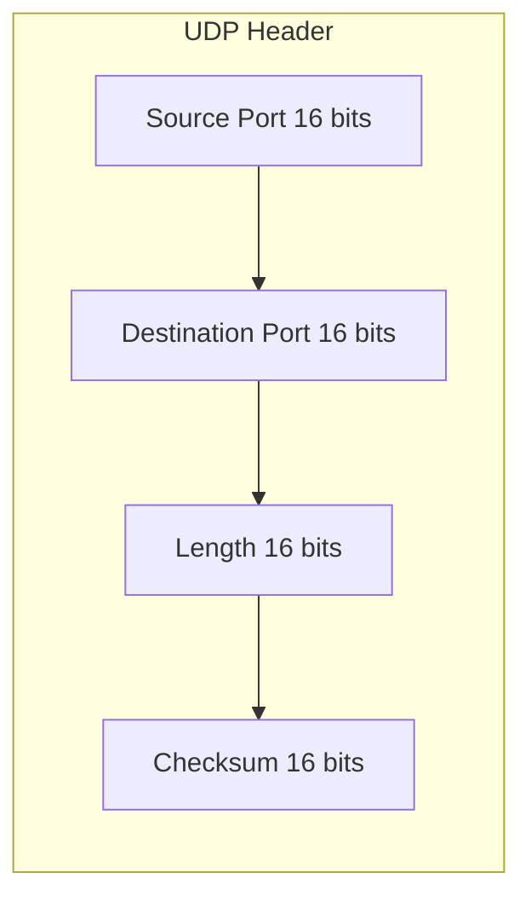
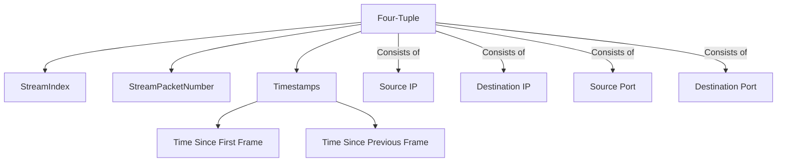
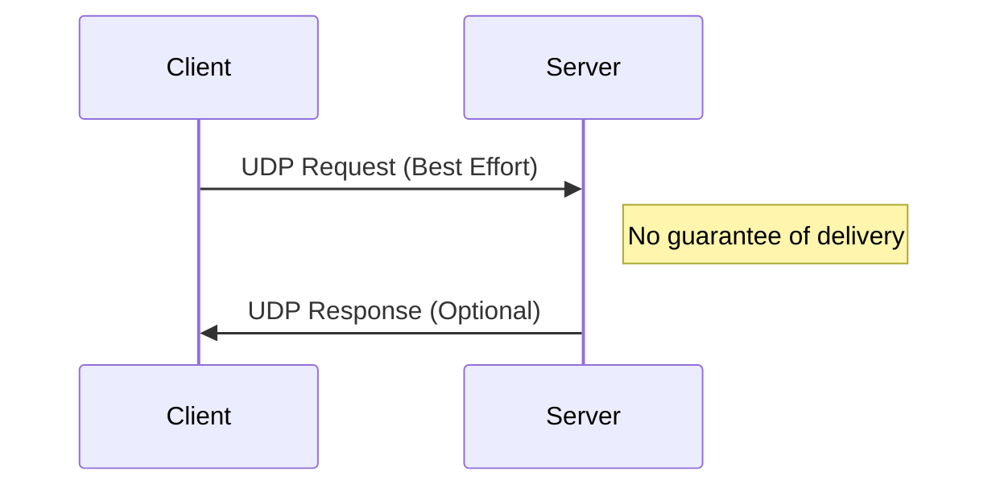

# UDP Header Reference

## 1. Terminology Clarification
- **Datagram**: A self-contained, independent unit of data in UDP (header + payload)
- **Packet**: The network layer unit containing IP header + UDP datagram
- **Segment**: TCP equivalent of a datagram (not used in UDP context)

## 2. UDP Header Structure

## 3. Header Field Explanation

### 3.1 Ports
- **Source Port** (e.g., 51698):
  - Ephemeral port on client side
  - Identifies return socket for communication
  - Dynamically assigned (non-significant value)
- **Destination Port** (e.g., 53):
  - Well-known port identifying service (DNS in this case)
  - Server uses to route to correct service

### 3.2 Length Field
- Total length of UDP datagram (header + payload) in bytes
- Fixed 8-byte header + variable payload

### 3.3 Checksum
- Validates header and payload integrity
- **Wireshark behavior**:
  - Validation disabled by default (due to NIC offloading)
  - Enable via: UDP Protocol Preferences → "Validate UDP checksum"

## 4. Wireshark Metadata (Non-Header Information)

- **Stream Index**: Unique conversation identifier based on four-tuple
- **Stream Packet Number**: Position within conversation
- **Timestamps**:
  - Time Since First Frame
  - Time Since Previous Frame (measures network RTT)

## 5. UDP Communication Characteristics

- Connectionless protocol
- Best-effort delivery (no acknowledgments)
- Common applications: DNS, DHCP, streaming media

## 6. Practical Analysis Techniques

### 6.1 Identifying Conversations
- Filter by stream index: `udp.stream eq 0`
- Analyze four-tuple changes:
  - Different source port = new stream (even to same destination)

### 6.2 Timing Analysis
- Use "Time Since Previous Frame" to measure:
  - Application response times
  - Network latency
- Example: DNS query-response timing

### 6.3 Checksum Validation
- Only enable when troubleshooting specific issues:
  - Unexplained packet drops
  - Suspected corruption
- Most NICs handle checksum offloading

## 7. Header Field Reference Table

| Field | Size | Description | Significance |
|-------|------|-------------|--------------|
| Source Port | 16 bits | Originating port | Ephemeral, identifies return socket |
| Destination Port | 16 bits | Target service port | Well-known (53=DNS, 67=DHCP, etc.) |
| Length | 16 bits | Datagram size (bytes) | Header (8B) + payload |
| Checksum | 16 bits | Data integrity | Optional validation in IPv4, mandatory in IPv6 |