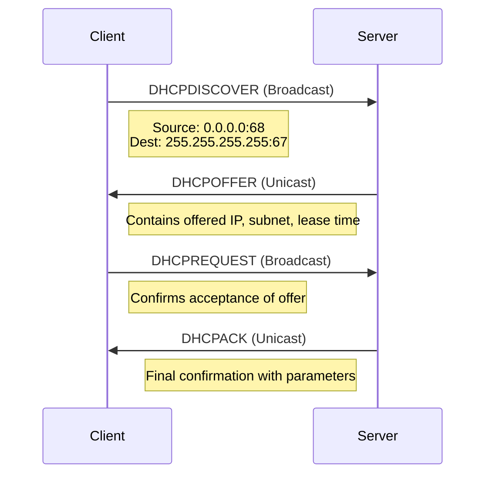

# Dynamic Host Configuration Protocol (DHCP) Reference

## Introduction
DHCP (Dynamic Host Configuration Protocol) is a network management protocol used to automatically assign IP addresses and other network configuration parameters to devices on a network. It operates on UDP ports 67 (server) and 68 (client).

## DHCP Components
1. **DHCP Client**: Device requesting network configuration
2. **DHCP Server**: Device providing configuration parameters
3. **DHCP Relay Agent**: Forwards requests between clients and servers on different subnets

## DHCP Message Types
| Message Type | Description |
|--------------|-------------|
| DHCPDISCOVER | Client broadcast to locate available servers |
| DHCPOFFER    | Server response to DHCPDISCOVER with offer |
| DHCPREQUEST  | Client request for specific offered parameters |
| DHCPACK      | Server confirmation of configuration |
| DHCPNAK      | Server refusal of configuration request |
| DHCPRELEASE  | Client relinquishes network address |
| DHCPINFORM   | Client requests local configuration only |

## DHCP Lease Process (DORA)

## Packet Structure Details
### DHCP Discover
- Source IP: 0.0.0.0
- Destination IP: 255.255.255.255
- Source Port: 68
- Destination Port: 67
- Client MAC in chaddr field
- Parameter Request List (options 1, 3, 6, 42 typically)

### DHCP Offer
- Your (client) IP address field populated
- Server IP address field populated
- Subnet mask, lease time, renewal time
- May include router, DNS servers, NTP servers

### DHCP Request
- Requested IP address field populated
- Server identifier field populated
- Repeats Parameter Request List

### DHCP ACK
- Confirms all assigned parameters
- Repeats lease time values
- Includes all granted options

## Lease Management
- **Lease Time**: Total duration of address assignment
- **Renewal Time (T1)**: Typically 50% of lease time
- **Rebinding Time (T2)**: Typically 87.5% of lease time
- **Expiration**: Client must release address if not renewed

## Common Configuration Parameters
| Option | Description |
|--------|-------------|
| 1      | Subnet Mask |
| 3      | Router (Default Gateway) |
| 6      | DNS Servers |
| 15     | Domain Name |
| 42     | NTP Servers |
| 51     | IP Address Lease Time |

## Troubleshooting Notes
1. **No IP Address Assigned**:
   - Verify DHCP server is running
   - Check for network connectivity issues
   - Verify no IP address conflicts

2. **Missing Configuration Parameters**:
   - Check server configuration for required options
   - Verify options are properly formatted

3. **Lease Renewal Failures**:
   - Verify server availability at renewal time
   - Check network connectivity
   - Verify lease database consistency

## References
- RFC 2131: Dynamic Host Configuration Protocol
- RFC 2132: DHCP Options and BOOTP Vendor Extensions