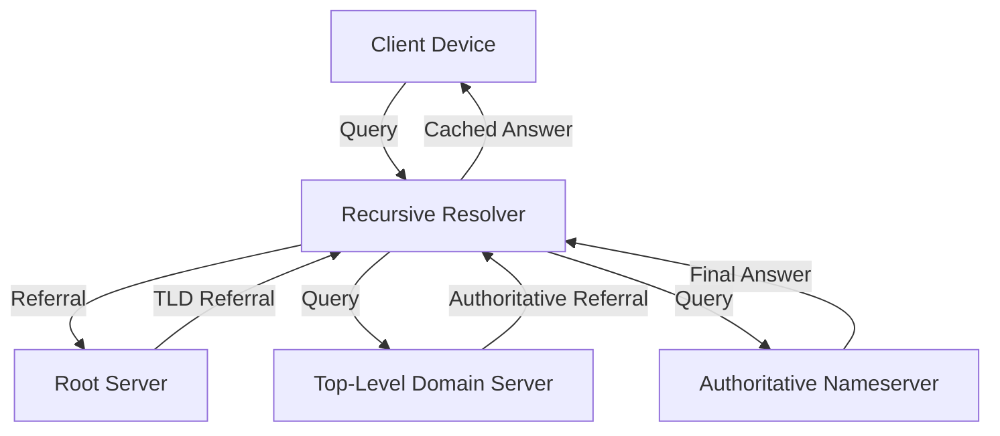

# How DNS Works - Comprehensive Reference

## I. DNS Fundamentals
Domain Name System (DNS) is the **hierarchical distributed naming system** that translates human-readable domain names (e.g., `example.com`) into machine-readable IP addresses. Key characteristics:
- Internet's "phone book" - critical infrastructure
- Supports forward (name→IP) and reverse (IP→name) lookups
- Uses UDP primarily (port 53), TCP for large responses
- Failure causes widespread connectivity issues ("It's always DNS")

## II. DNS Resolution Hierarchy
DNS resolution involves four key components in a hierarchical chain:

1. **Recursive Resolver (DNS Resolver)**  
   - First contact point for clients
   - Maintains cache of recent queries
   - Initiates resolution chain if answer not cached

2. **Root Nameservers**  
   - 13 logical servers (a.root-servers.net to m.root-servers.net)
   - Direct queries to appropriate TLD servers
   - Respond with referral: "I don't know `example.com`, but ask `.com` TLD server"

3. **Top-Level Domain (TLD) Servers**  
   - Manage domain extensions (.com, .org, .net)
   - Respond with referral to authoritative nameserver: "Ask `ns1.example.com`"

4. **Authoritative Nameservers**  
   - Final authority for specific domains
   - Return actual IP address for queried name
   - Domain owners manage these servers

## III. Protocol Details
### Record Types
| Record | Purpose | Example |
|--------|---------|---------|
| A      | IPv4 address | `192.0.2.1` |
| AAAA   | IPv6 address | `2001:db8::1` |
| NS     | Authoritative nameserver | `ns1.example.com` |
| CNAME  | Canonical name (alias) | `www.example.com → example.com` |

### Transport Protocols
- **UDP (Default)**  
  - Port 53
  - Used for most queries (fast, lightweight)
  - Client handles retransmission on timeout
- **TCP (Fallback)**  
  - Used for:
    - Responses > 512 bytes
    - Zone transfers between nameservers
    - When UDP fails

## IV. Wireshark Analysis
### Key Filters
- `dns` - Show all DNS traffic
- `dns.time` - Response time field
- `dns.flags.response == 0` - Requests only
- `dns.flags.response == 1` - Responses only

### Analysis Techniques
1. **Transaction Tracking**  
   Match requests/responses using:
   - Transaction ID (e.g., `0x61b2`)
   - Wireshark's built-in grouping ([ ] indicators)

2. **Column Customization**  
   Add columns for:
   - Queried Name (`dns.qry.name`)
   - Response Address (`dns.a`)
   - Response Time (`dns.time`)

3. **Response Time Analysis**  
   - Normal: < 100ms
   - Investigate if > 500ms
   - Filter: `dns.time > 0.5`

## V. Practical Tips
- **Caching Importance**: Resolvers cache responses (TTL-based) to reduce global DNS load
- **Troubleshooting Flow**:
  1. Check local resolver cache (`ipconfig /displaydns` on Windows)
  2. Verify recursive resolver reachability
  3. Inspect root/TLD server responses
- **Wireshark Profile**: Create dedicated DNS profile with columns for:
  - Queried Name
  - Response Address
  - Response Time
  - Record Type