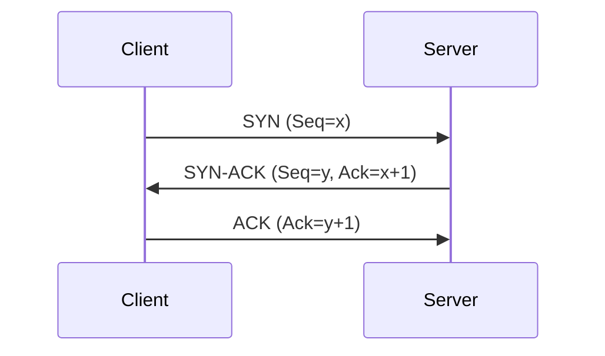
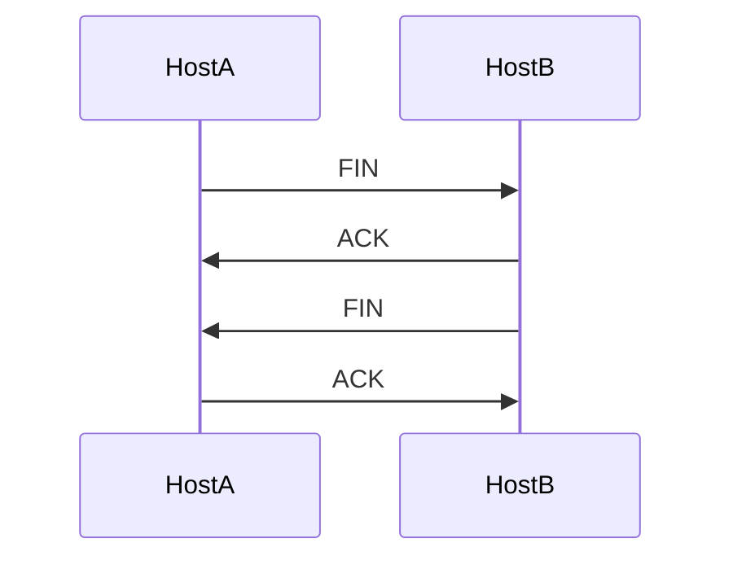

# Practical TCP Analysis: A Comprehensive Reference

## Table of Contents
1. [Introduction to TCP](#introduction-to-tcp)
2. [TCP Connection Lifecycle](#tcp-connection-lifecycle)
    - [Three-Way Handshake](#three-way-handshake)
    - [Connection Termination](#connection-termination)
3. [TCP Segment Structure](#tcp-segment-structure)
    - [Sequence and Acknowledgement Numbers](#sequence-and-acknowledgement-numbers)
    - [TCP Flags](#tcp-flags)
    - [TCP Options](#tcp-options)
    - [Window Size and Flow Control](#window-size-and-flow-control)
4. [TCP Analysis in Wireshark](#tcp-analysis-in-wireshark)
5. [Appendix: Diagrams](#appendix-diagrams)

---

## Introduction to TCP

The Transmission Control Protocol (TCP) is a connection-oriented, reliable, byte-stream protocol. It establishes and maintains a stateful connection between two endpoints, ensuring that all data sent by the application is delivered reliably and in order.

---

## TCP Connection Lifecycle

### Three-Way Handshake

TCP uses a three-way handshake to establish a connection between a client and a server. This process synchronizes sequence numbers and negotiates connection parameters.

#### Steps:
1. **SYN**: The client initiates the connection by sending a SYN (synchronize) segment, indicating its initial sequence number and connection parameters.
2. **SYN-ACK**: The server responds with a SYN-ACK, acknowledging the client's SYN and providing its own initial sequence number and parameters.
3. **ACK**: The client sends an ACK, acknowledging the server's SYN. The connection is now established.

#### Diagram: TCP Three-Way Handshake

### Connection Termination

TCP connections are terminated using a four-way handshake (FIN/ACK exchange) or, in some cases, abruptly with a RST (reset).

#### Steps:
1. **FIN**: One side initiates termination by sending a FIN segment.
2. **ACK**: The other side acknowledges the FIN.
3. **FIN**: The other side sends its own FIN when ready.
4. **ACK**: The initiator acknowledges the second FIN. The connection is closed.

#### Diagram: TCP Four-Way Termination

A connection can also be reset immediately with a RST segment, which is an abortive release.

---

## TCP Segment Structure

### Sequence and Acknowledgement Numbers
- **Sequence Number**: Indicates the byte number of the first byte in the segment's data. Initial sequence numbers are chosen randomly and synchronized during the handshake.
- **Acknowledgement Number**: Indicates the next expected byte from the sender. It is always one more than the last successfully received byte.
- **Rule**: `acknowledgement number = received sequence number + segment length`
- Each direction maintains its own sequence number space.

### TCP Flags
TCP flags define the purpose and function of each segment:
- **SYN**: Initiate connection and synchronize sequence numbers.
- **ACK**: Acknowledge received data or connection setup.
- **FIN**: Gracefully terminate a connection.
- **RST**: Abruptly reset a connection.
- **PSH (Push)**: Instructs the receiver to pass data to the application immediately.
- **URG (Urgent)**: Indicates urgent data (rarely used).
- **ECN, CWR**: Used for Explicit Congestion Notification (rare in practice).

#### Common Flag Combinations
- SYN
- SYN-ACK
- ACK
- FIN-ACK
- RST

### TCP Options
Options are exchanged during the handshake to advertise capabilities:
- **MSS (Maximum Segment Size)**: Maximum segment size the sender can receive.
- **SACK (Selective Acknowledgement)**: Allows acknowledgement of non-contiguous data blocks.
- **Window Scale**: Multiplies the window size for high-latency, high-bandwidth networks.
- **Timestamps**: Used for round-trip time measurement (optional).
- **NOP (No Operation)**: Padding.

Options are exchanged, not negotiated. Each side advertises its own capabilities.

### Window Size and Flow Control
- **Window Size**: The amount of data the receiver is willing to accept without acknowledgement.
- **Window Scale Option**: Allows for larger window sizes by applying a scale factor.
- **Flow Control**: TCP dynamically adjusts the window size to manage congestion and receiver capacity.

---

## TCP Analysis in Wireshark

- **Conversation Filter**: Use to isolate a TCP stream.
- **Delta Time**: Measure round-trip time by examining the time between SYN and SYN-ACK.
- **Sequence and Ack Numbers**: Wireshark displays both raw and relative numbers for easier analysis.
- **TCP Options**: Visible in the handshake packets.
- **Flags**: Analyze segment purpose and connection state.
- **Window Size**: Observe flow control and scaling.

**Best Practice:** Always capture the handshake for complete analysis. Start capture before initiating the connection.

---

## Appendix: Diagrams

### TCP Three-Way Handshake

### TCP Four-Way Termination

---

**End of Reference**
