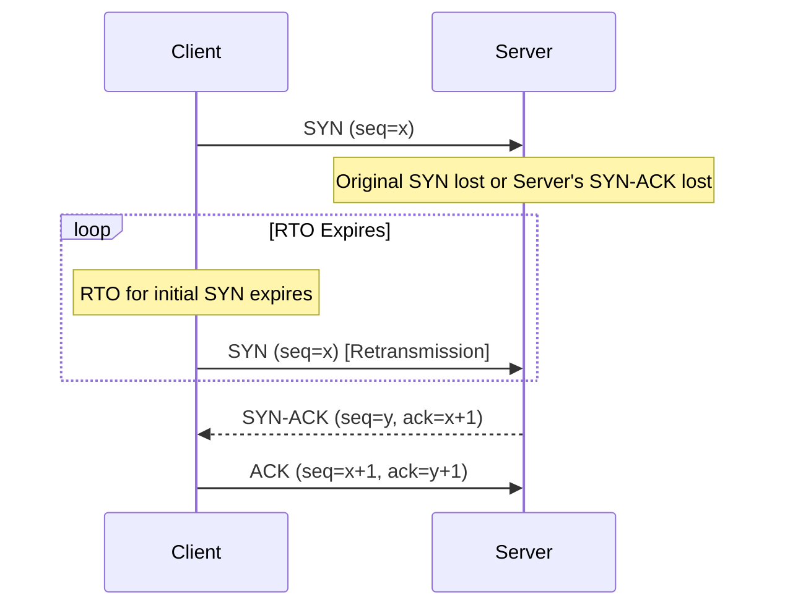
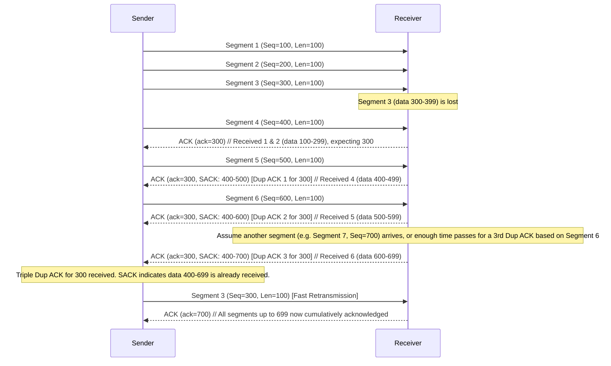

# TCP Retransmission: A Comprehensive Reference

## 1. Introduction: TCP's Commitment to Reliability

The Transmission Control Protocol (TCP) is a cornerstone of modern networking, providing a **connection-oriented** and **reliable** data delivery service. A key aspect of this reliability is TCP's ability to detect and recover from data loss. If any data, even a single byte, fails to reach its destination, TCP employs mechanisms to retransmit that data, ensuring complete and accurate information transfer.

To achieve this, a TCP sender maintains a copy of the data it has sent in its **send buffer**. This data is only cleared from the buffer once the sender receives an acknowledgment (ACK) from the receiver confirming its successful arrival. This retention of sent data is crucial, as it allows the sender to quickly resend any segments that were lost or corrupted in transit.

## 2. Triggers for TCP Retransmission

TCP retransmissions are primarily triggered by two mechanisms: the expiration of a Retransmission Timeout (RTO) or the receipt of a certain number of Duplicate Acknowledgements (leading to Fast Retransmission).

### 2.1. Retransmission Timeout (RTO)

When a TCP sender transmits a segment, it starts a **Retransmission Timer**. If this timer expires before an ACK for that segment is received, the sender assumes the segment (or its corresponding ACK) was lost and retransmits the segment. This is known as a timeout-based retransmission.

**Example: Initial SYN Packet Loss**
A common scenario for an RTO-based retransmission occurs during the initial TCP handshake:
1.  The client sends a SYN (synchronize) packet to the server to initiate a connection.
2.  The client starts an RTO and waits for a SYN-ACK from the server.
3.  If the SYN-ACK is not received before the RTO expires (e.g., an older stack might have an initial RTO of 3 seconds), the client retransmits the SYN packet.

**Ambiguity with One-Sided Captures:**
When analyzing a packet capture taken from only one side of the communication (e.g., only the client-side), it can be difficult to determine the exact cause of the RTO:
*   Did the original segment (e.g., SYN) ever reach the destination?
*   Was the return segment (e.g., SYN-ACK) lost on its way back?
*   Did the segment reach the destination, but the destination was too busy or unable to respond?

To definitively answer these questions, obtaining simultaneous packet captures from **both the sender and receiver sides** is highly beneficial.

**Inferring Capture Location with Time To Live (TTL):**
The TTL field in the IP header can provide clues about the capture location. A packet's TTL is decremented by each router it traverses.
*   If capturing on the client-side, packets from a remote server will likely have a TTL lower than their initial value (e.g., initial TTL of 128 might arrive as 113 after several hops).
*   This helps place the capture point within the network path.

### 2.2. Fast Retransmission

Fast Retransmission is a mechanism that allows TCP to recover from segment loss more quickly than waiting for an RTO. It is typically triggered by the sender receiving a specific number of **Duplicate Acknowledgements (Dup ACKs)**.

*   **Trigger:** Usually, three Dup ACKs for the same sequence number. This is often referred to as a "Triple Dup ACK."
*   **Rationale:** When a receiver gets segments out of order, it continues to send ACKs for the last in-order byte sequence it *expected*. If it receives, for example, segment 1, then segment 3, it will send an ACK for segment 1 (expecting segment 2). When segment 4 arrives, it will again send an ACK for segment 1. These subsequent ACKs for segment 1, while later segments are arriving, are Dup ACKs.
*   **Sender's Inference:** Receiving multiple Dup ACKs signals to the sender that:
    1.  A segment was likely lost (the one being repeatedly ACKed for).
    2.  The receiver is successfully receiving subsequent segments (otherwise, it wouldn't be sending ACKs triggered by their arrival).
*   **Action:** The sender retransmits the missing segment without waiting for its RTO to expire.

The key advantage of Fast Retransmission is its speed, as the sender is alerted to likely packet loss by the receiver's feedback much sooner than an RTO would typically occur.

## 3. Identifying and Quantifying Packet Loss

Wireshark provides valuable insights into potential packet loss and retransmission events.

### 3.1. Wireshark Indication: "TCP Previous segment not captured"

When Wireshark displays the "TCP Previous segment not captured" expert info message, it indicates a gap in the sequence numbers it has observed in one direction of the TCP stream.
*   **Caution:** Wireshark is careful not to definitively state "packet lost." The missing segment might have been dropped by the network, or it could be an artifact of the capture process itself (e.g., the packet capture device was overwhelmed, or packets were dropped by a SPAN port).
*   Regardless of the cause from Wireshark's perspective, the TCP endpoint experiencing the gap will perceive it as packet loss and react accordingly.

### 3.2. Sequence Number Analysis for Gap Detection

To understand the extent of missing data, one must analyze TCP sequence numbers:
1.  **Identify the last successfully received in-order segment** before the gap. Note its sequence number (`LastGoodSeq`) and its length (`LastGoodLen`).
2.  **Calculate the expected sequence number** of the missing segment(s): `NextExpectedSeq = LastGoodSeq + LastGoodLen`.
3.  **Identify the first segment received *after* the gap.** Note its sequence number (`FirstSeqAfterGap`).
4.  **The gap in sequence numbers** starts at `NextExpectedSeq` and ends just before `FirstSeqAfterGap`.
5.  **Calculate the amount of missing data (bytes):** `MissingBytes = FirstSeqAfterGap - NextExpectedSeq`.

**Example from Transcript (Lab 10):**
*   Last in-order segment received by client (from server): Seq = 1,047,438, Len = 1,460 bytes.
*   Next expected sequence number from server: 1,047,438 + 1,460 = **1,048,898**.
*   First segment seen after the gap (Wireshark flags as "Previous segment not captured"): Seq = 1,095,618.
*   Amount of missing data: 1,095,618 - 1,048,898 = **46,720 bytes**.
*   If the Maximum Segment Size (MSS) is consistent (e.g., 1460 bytes), the number of missing packets can be estimated: 46,720 bytes / 1460 bytes/packet = **32 packets**.

## 4. The Role of Acknowledgements in Recovery

Acknowledgements are fundamental to TCP's recovery mechanisms.

### 4.1. Duplicate Acknowledgements (Dup ACKs)

*   **Definition:** A Dup ACK is an ACK that re-acknowledges a segment that has already been acknowledged. It carries the same acknowledgment number as a previous ACK from the same endpoint.
*   **Purpose:**
    *   To signal the sender that an out-of-order segment has arrived.
    *   To repeatedly inform the sender of the sequence number of the segment the receiver is still expecting (the start of the missing data).
*   **Generation:** When a TCP receiver gets a segment with a sequence number higher than the next expected one, it indicates a gap. For each subsequent segment it receives that is beyond this gap, it will send a Dup ACK, reiterating the sequence number of the *first* missing byte.

### 4.2. Selective Acknowledgements (SACK)

SACK is a TCP option that significantly enhances the efficiency of recovery from multiple lost segments.
*   **Negotiation:** SACK capability is negotiated during the TCP three-way handshake using the "SACK Permitted" option in SYN segments.
*   **Purpose:** SACK allows a receiver to inform the sender about non-contiguous blocks of data it has successfully received *beyond* the cumulative acknowledgment point (the `AckNum` field in the TCP header).
*   **Mechanism:** The SACK option, when present in a TCP segment, contains one or more blocks. Each block is defined by a **Left Edge** and a **Right Edge**:
    *   **Left Edge:** The sequence number of the first byte of a contiguous block of received data.
    *   **Right Edge:** The sequence number of the byte immediately *after* the last byte of that contiguous block.
*   **How it Works:**
    1.  The receiver's cumulative ACK (`AckNum`) indicates all data up to `AckNum - 1` has been received.
    2.  If there's a gap (e.g., segment `N` is missing), but segment `N+1`, `N+2` arrive, the receiver sends Dup ACKs for segment `N`.
    3.  If SACK is enabled, these Dup ACKs will also carry SACK blocks specifying the ranges of data received beyond the gap (e.g., SACK: LeftEdge=`Seq(N+1)`, RightEdge=`Seq(N+2) + Len(N+2)`).
    4.  As more out-of-order segments arrive, the SACK blocks are updated, often by extending the Right Edge of an existing block or adding new blocks.
*   **Benefit:** SACK provides the sender with precise information about which segments have been received and which are missing. This allows the sender to retransmit *only* the truly lost segments, avoiding unnecessary retransmissions of data that the receiver already has (albeit out of order).

**Diagram: Fast Retransmission with Duplicate ACKs and SACK**

## 5. Wireshark Analysis Techniques for Retransmissions

Wireshark is an indispensable tool for analyzing TCP retransmissions.

### 5.1. Key Wireshark Filters and Indicators

*   **Expert Information:** Pay close attention to TCP expert messages in the packet details pane or as a column:
    *   `TCP Retransmission`: General indicator of a retransmitted segment. This can be due to RTO or other reasons.
    *   `TCP Fast Retransmission`: Indicates a retransmission likely triggered by Dup ACKs.
    *   `TCP Spurious Retransmission`: Indicates a segment was retransmitted unnecessarily (the original was received, or an ACK was simply delayed).
    *   `TCP Duplicate ACK (#N)`: Shows a duplicate acknowledgment, with `N` being the count of this specific Dup ACK.
    *   `TCP Previous segment not captured`: Highlights a gap in sequence numbers.
    *   `TCP ACKed unseen segment`: The ACK acknowledges data that Wireshark didn't see transmitted.
*   **Display Filters:**
    *   `tcp.analysis.retransmission`: Shows all packets flagged as retransmissions (both standard and fast).
    *   `tcp.analysis.fast_retransmission`: Shows only fast retransmissions.
    *   `tcp.analysis.duplicate_ack`: Shows all duplicate ACKs.
    *   Combine filters: `tcp.analysis.retransmission or tcp.analysis.fast_retransmission`
*   **Conversation Context:**
    *   Right-click a packet and select `Follow > TCP Stream` to see the payload data.
    *   Right-click and choose `Conversation Filter > TCP` to isolate the entire TCP conversation for the selected packet.

### 5.2. Useful Columns for Analysis

Customize Wireshark columns for efficient TCP analysis:
*   `Source`, `Destination`
*   `Time` (delta displayed or absolute)
*   `Info` (shows expert info summaries)
*   `tcp.seq` (Absolute Sequence Number)
*   `tcp.ack` (Absolute Acknowledgment Number)
*   `tcp.len` (TCP Segment Length - payload length)
*   **Relative Sequence/Acknowledgement Numbers:** Wireshark can display sequence and acknowledgment numbers relative to the initial sequence number of the stream. This often makes them easier to read. Add columns for `tcp.relseq` and `tcp.relack` if available, or configure existing sequence/ack number columns to display relative values.
*   `tcp.options.sack.edge`: To see SACK block edges.
*   `ip.ttl`: Time To Live.

You can rename column titles for brevity (e.g., "Sequence Number" to "Seq#") by right-clicking the column header and selecting "Edit Column."

### 5.3. Time Analysis

*   **Network Round Trip Time (RTT):** Observe the time delta between a SYN and its SYN-ACK, or a data segment and its ACK, early in the connection to establish a baseline RTT.
*   **Set Time Reference:** Right-click any packet and select `Set/Unset Time Reference` (or `Ctrl+T`). This sets the time display for subsequent packets relative to this reference packet (delta time). This is invaluable for:
    *   Measuring the delay from when a gap is first detected (e.g., "Previous segment not captured") until the missing data is retransmitted.
    *   Measuring the time between Dup ACKs.

### 5.4. Examining TCP Options

During the handshake (SYN, SYN-ACK packets), inspect the TCP options:
*   `Maximum Segment Size (MSS)`: The largest amount of data TCP will send in a single segment.
*   `Window Scale`: If present, indicates the window scaling factor.
*   `SACK Permitted`: Indicates if Selective Acknowledgement is allowed for this connection.

## 6. Distinguishing Retransmission Types

*   **Standard (Timeout-Based) Retransmission (`tcp.analysis.retransmission` in Wireshark, if not also flagged as fast):**
    *   Occurs because an RTO timer expired for a sent segment. The sender did not receive an ACK for that segment within the timeout period.
    *   The sender retransmits the segment it assumes was lost.
    *   RTO values are dynamic and adapt to network conditions, but generally, TCP tries not to be too hasty to avoid unnecessary retransmissions if an ACK is merely delayed.
*   **Fast Retransmission (`tcp.analysis.fast_retransmission`):**
    *   Triggered by the receipt of a certain number (typically three) of Dup ACKs.
    *   The Dup ACKs signal to the sender that the receiver has received data *beyond* an expected segment, strongly implying that the expected segment is lost.
    *   This mechanism is "fast" because it usually allows retransmission sooner than an RTO would expire.

Fundamentally, both types of retransmissions indicate that the sender believes data was lost and is attempting to resend it. The trigger is the main difference.

## 7. Impact and Troubleshooting of Packet Loss

*   **Impact on Applications:** Retransmissions, while essential for reliability, introduce **delay**. When TCP has to recover lost packets, the application experiences pauses or slowdowns. Significant packet loss can severely degrade application performance and user experience.
*   **Troubleshooting Goal:** The primary goal when observing retransmissions is to identify and rectify the **root cause of the packet loss**.
*   **Potential Causes of Packet Loss** (though not detailed in the source transcript, these are common culprits):
    *   Network congestion (routers or links overwhelmed).
    *   Faulty network hardware (cables, NICs, switch ports).
    *   Duplex mismatches.
    *   Wireless interference or poor signal.
    *   Overloaded servers dropping packets.
    *   Firewalls or other security devices dropping packets.

## 8. Key Takeaways

*   TCP's reliability hinges on its ability to retransmit lost data.
*   Retransmissions are triggered by RTO expiry or Fast Retransmission (via Dup ACKs).
*   SACK significantly improves recovery efficiency when multiple segments are lost.
*   Wireshark is a powerful tool for dissecting retransmission behavior using filters, custom columns, and time analysis.
*   While retransmissions ensure data delivery, they indicate underlying packet loss, which negatively impacts performance and should be investigated.

Understanding TCP retransmission mechanisms is crucial for network engineers and analysts to effectively troubleshoot performance issues and ensure robust network communication.