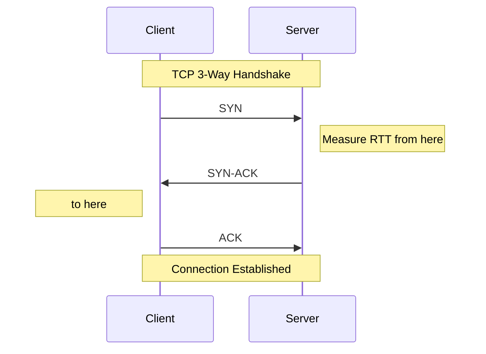
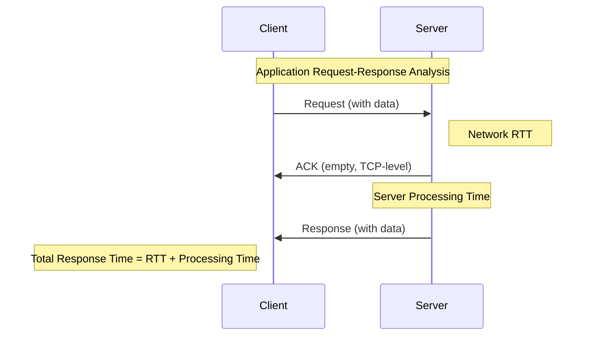
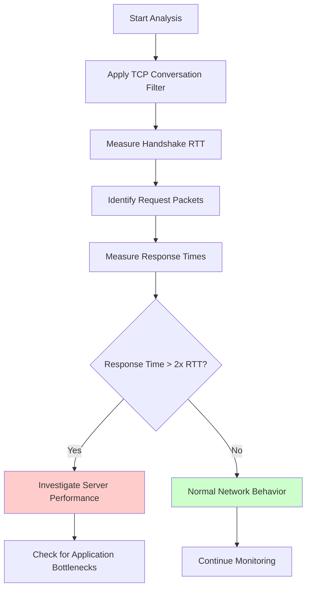

# Case Study: Analyzing Slow Application Response Time

## Overview

Application response time analysis is a critical skill in network troubleshooting. This document provides a systematic approach to identifying and measuring application delays using Wireshark, applicable to both unencrypted and encrypted traffic.

## Key Concepts

### Network Round Trip Time (RTT)
- **Definition**: The time it takes for a packet to travel from client to server and receive an acknowledgment
- **Measurement Point**: TCP handshake provides the baseline RTT
- **Significance**: Establishes network latency baseline for comparison with application response times

### Application Response Time
- **Definition**: The time between client request and server's first data response
- **Components**: Network RTT + Server processing time
- **Critical Insight**: Differentiates between network delays (unavoidable) and server processing delays (actionable)

## Analysis Workflow

### Phase 1: Establish Network Baseline

#### Step 1: Identify TCP Handshake
1. Apply conversation filter: `Right-click packet → Conversation Filter → TCP`
2. Locate the 3-way handshake sequence:
   - SYN packet (client to server)
   - SYN-ACK packet (server to client)  
   - ACK packet (client to server)

#### Step 2: Measure Network RTT
- **Method**: Time difference between SYN and SYN-ACK packets
- **Purpose**: Establishes network latency baseline
- **Example**: 14 milliseconds RTT = network infrastructure delay

### Phase 2: Analyze Application Response Time

#### Step 3: Identify Request-Response Patterns
1. Locate client request packets (with data payload)
2. Find corresponding server response packets
3. Measure time intervals between request and response

#### Step 4: Compare RTT vs Response Time
- **Network ACK Time**: Should match handshake RTT (~15ms in example)
- **Application Response Time**: Total time from request to data response (~22ms in example)
- **Server Processing Time**: Response Time - Network RTT (22ms - 15ms = 7ms processing)

### Phase 3: Advanced Analysis Techniques

#### For HTTP Traffic (Unencrypted)

**Using Time Since Request Column:**
1. Right-click HTTP response packet
2. Navigate to "Time since request" field
3. Select "Apply as Column"
4. Remove filters and sort by this column
5. Identify longest response times

#### For Encrypted Applications

**Challenge**: Cannot see application-layer request/response boundaries

**Solution**: TCP-level analysis
1. Monitor TCP segment timing patterns
2. Look for larger packet bursts (potential responses)
3. Compare timing against baseline RTT

**Key TCP Fields for Analysis:**
- **RTT to ACK the segment**: Persistent RTT measurement
- **Time since previous frame in TCP stream**: Inter-packet delays within conversation

### Phase 4: Systematic Delay Detection

#### Using TCP Stream Analysis
1. Add column: "Time since previous frame in this TCP stream"
2. Sort by this column (descending)
3. Identify largest delays in context
4. Correlate with application behavior

#### Filtering False Positives
**Common Issue**: Connection teardown delays
- **Symptom**: Large delays at end of TCP conversation
- **Impact**: Cosmetic - doesn't affect user experience
- **Solution**: Focus on delays during active data transfer phase

## Practical Analysis Examples

### Example 1: HTTP Application (Lab 11)
- **Scenario**: Web application with slow response
- **Method**: Time reference on request packet
- **Result**: 108 seconds application response time
- **Conclusion**: Severe server-side processing delay

### Example 2: Mixed Traffic Analysis (Lab 1)
- **Network RTT**: 14ms (from handshake)
- **Request ACK**: 15ms (confirms network baseline)
- **Application Response**: 22ms
- **Server Processing**: 7ms (reasonable)

### Example 3: Encrypted Application Analysis
- **Challenge**: No visible HTTP headers
- **Approach**: TCP timing analysis
- **Baseline RTT**: 14ms
- **Observed Response**: 53ms
- **Analysis**: 39ms server processing time (potential performance issue)

## Troubleshooting Workflow

## Best Practices

### Visual Inspection Techniques
1. **Muscle Memory Development**: Train eyes to quickly spot handshake patterns
2. **Time Reference Usage**: Set reference points for relative timing analysis
3. **Column Customization**: Add relevant timing columns for efficient analysis

### Analytical Approach
1. **Establish Baseline First**: Always measure network RTT before analyzing application delays
2. **Context Awareness**: Consider application type and expected response times
3. **Pattern Recognition**: Look for consistent delays vs. intermittent issues

### Common Pitfalls
1. **Packet Reordering**: "Previous segment not captured" often indicates packet reordering, not loss
2. **Connection Teardown**: Large delays at conversation end are typically benign
3. **Encrypted Traffic**: Focus on timing patterns rather than payload content

## Key Metrics to Monitor

| Metric | Normal Range | Investigation Threshold | Action Required |
|--------|--------------|------------------------|-----------------|
| Network RTT | < 50ms LAN, < 200ms WAN | > 2x baseline | Check network infrastructure |
| Server Response | < 2x RTT | > 5x RTT | Investigate application performance |
| Request-to-ACK | ≈ Network RTT | > 2x RTT | Check network congestion |

## Tools and Techniques Summary

### Wireshark Features Used
- **Conversation Filters**: Isolate TCP streams
- **Time References**: Relative timing measurements  
- **Custom Columns**: "Time since request", "Time since previous frame"
- **Sorting**: Identify largest delays
- **TCP Analysis**: Built-in RTT calculations

### Analysis Methodology
1. **Quantitative**: Measure actual response times
2. **Comparative**: Compare against network baseline
3. **Contextual**: Consider application requirements
4. **Systematic**: Use consistent analysis workflow

## Conclusion

Effective application response time analysis requires a systematic approach that differentiates between network-imposed delays and application processing delays. By establishing network RTT baselines through TCP handshake analysis and comparing them with actual application response times, network analysts can pinpoint performance bottlenecks and guide targeted optimization efforts.

The techniques presented work for both encrypted and unencrypted applications, making them valuable for modern network environments where HTTPS and other encrypted protocols dominate traffic patterns.
