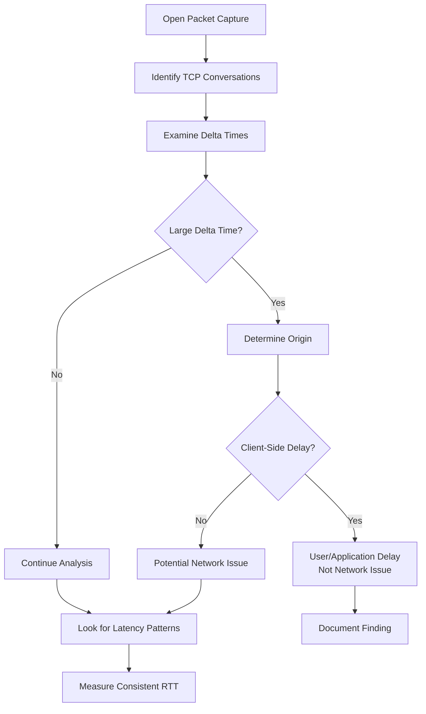
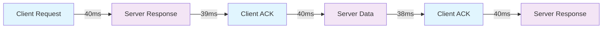
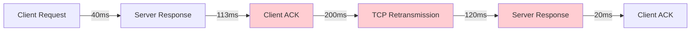
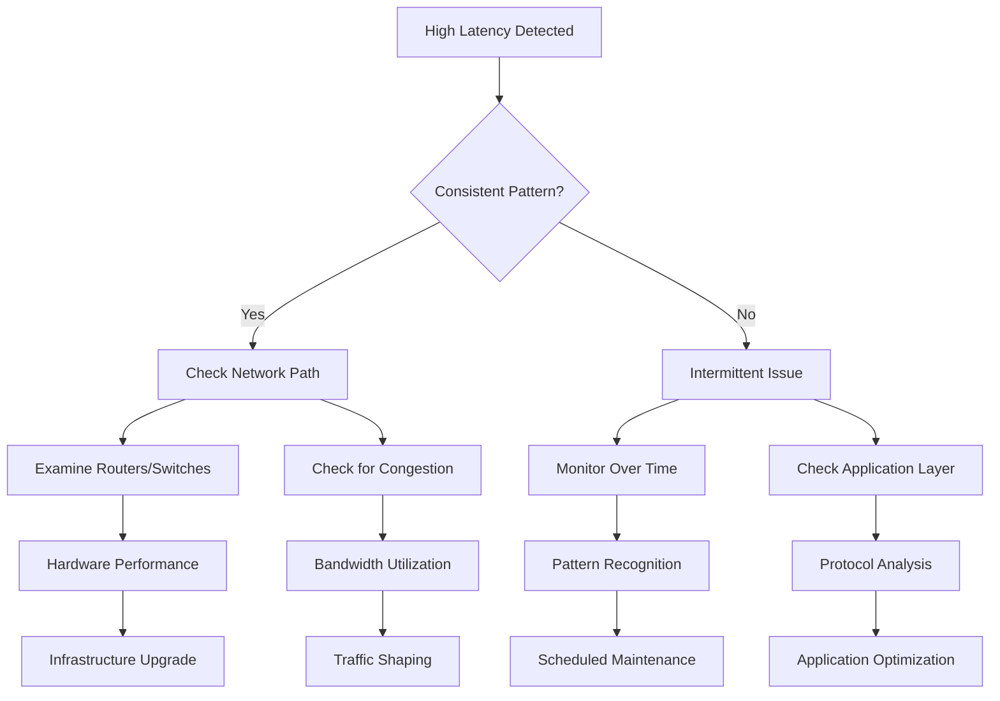

# Case Study: High Network Latency Analysis

## Overview

Network latency analysis is a critical skill for network troubleshooting. This document provides a systematic approach to identifying, measuring, and interpreting network latency patterns using Wireshark packet capture analysis.

## Key Concepts

### Network Latency Definition
**Network Latency** is the time delay between when a client sends a packet to a server and receives an acknowledgment or response. It represents the actual transit time through the network infrastructure.

### Round Trip Time (RTT)
**Round Trip Time (RTT)** is the total time for a packet to travel from source to destination and back to the source. This includes:
- Network transmission delay
- Processing time at destination
- Return transmission delay

## Latency Analysis Workflow

### 1. Initial Packet Examination



### 2. Distinguishing Client vs Network Delays

#### Client-Side Delays (Ignore for Network Analysis)
- **User interaction delays**: Password typing, browser navigation
- **Application processing**: Software initialization, file operations
- **Characteristics**: Often 3+ seconds, sporadic occurrence

#### Network-Side Delays (Investigate Further)
- **Network transmission**: Router/switch processing, congestion
- **Infrastructure issues**: Equipment overload, path optimization
- **Characteristics**: Consistent patterns, millisecond-range variations

### 3. Systematic Latency Measurement

#### Using Wireshark's "Time Since Previous Packet in TCP Conversation"

1. **Apply the field**: `tcp.time_since_previous_packet`
2. **Sort by time values**: Identify patterns and outliers
3. **Establish baseline RTT**: Look for consistent response times
4. **Identify anomalies**: Values significantly higher than baseline

## Latency Pattern Analysis

### Healthy Network Characteristics



**Indicators of Healthy Network:**
- Consistent RTT values (±5ms variation)
- Example: 38-40ms range consistently
- Minimal jitter in response times

### Problematic Network Patterns



**Warning Signs:**
- **High variation**: RTT jumping from 40ms to 100ms+ 
- **Retransmission delays**: 200ms+ for retransmitted packets
- **Erratic patterns**: Inconsistent timing (40ms → 100ms → 20ms)

## Technical Implementation

### Wireshark Analysis Steps

#### Step 1: Filter TCP Conversations
```
tcp.stream eq [stream_number]
```

#### Step 2: Add Time Delta Column
- Right-click column header → Column Preferences
- Add: "Time since previous packet in TCP conversation"

#### Step 3: Sort and Analyze
- Click column header to sort by time values
- Look for patterns and outliers
- Document baseline RTT values

### Measurement Interpretation

#### Normal Latency Ranges
- **LAN**: 1-5ms
- **Metropolitan Area**: 5-20ms  
- **Regional WAN**: 20-50ms
- **Intercontinental**: 100-300ms

#### Investigation Thresholds
- **Variation > 50%**: Investigate network path
- **Retransmission delays > 3x baseline**: Check for congestion
- **Consistent high latency**: Examine routing/infrastructure

## Troubleshooting Decision Tree



## Common Scenarios and Solutions

### Scenario 1: Gradual Latency Increase
**Symptoms**: RTT slowly increases over time
**Likely Cause**: Network congestion, equipment degradation
**Investigation**: Monitor bandwidth utilization, check equipment health

### Scenario 2: Sporadic High Latency
**Symptoms**: Occasional spikes in RTT (40ms → 200ms → 40ms)
**Likely Cause**: Competing traffic, QoS issues
**Investigation**: Traffic analysis during spike periods

### Scenario 3: Consistent High Latency
**Symptoms**: All connections show elevated RTT
**Likely Cause**: Routing inefficiency, geographic distance
**Investigation**: Traceroute analysis, routing table examination

## Best Practices

### Analysis Guidelines
1. **Establish baseline**: Measure normal network performance
2. **Consider context**: Time of day, network usage patterns
3. **Multiple samples**: Don't rely on single packet captures
4. **Document findings**: Record normal vs abnormal patterns

### Common Pitfalls
- **Misidentifying client delays**: Don't blame network for user behavior
- **Single-point analysis**: One high RTT doesn't indicate network issue
- **Ignoring application layer**: Some delays are protocol-specific

## Key Metrics to Monitor

| Metric | Normal Range | Investigation Threshold |
|--------|--------------|------------------------|
| RTT Variation | ±10% | >25% |
| Retransmission Delay | 2-3x RTT | >5x RTT |
| Consecutive High RTTs | <3 occurrences | >5 occurrences |
| Baseline Shift | ±15% | >30% |

## Conclusion

Effective network latency analysis requires systematic observation of timing patterns, proper interpretation of delay sources, and understanding of normal vs. abnormal network behavior. By following this structured approach, network administrators can quickly identify and resolve latency issues while avoiding false positives from client-side delays.

## Related Topics
- [TCP Retransmission Analysis](Raymond-Notes-17_TCP-Retransmission.md)
- [Practical TCP Analysis](Raymond-Notes-16_Practical-TCP-Analysis.md)
- [Slow Application Response Time](Raymond-Notes-18_Case-Study-Slow-Application-Response-Time.md)
