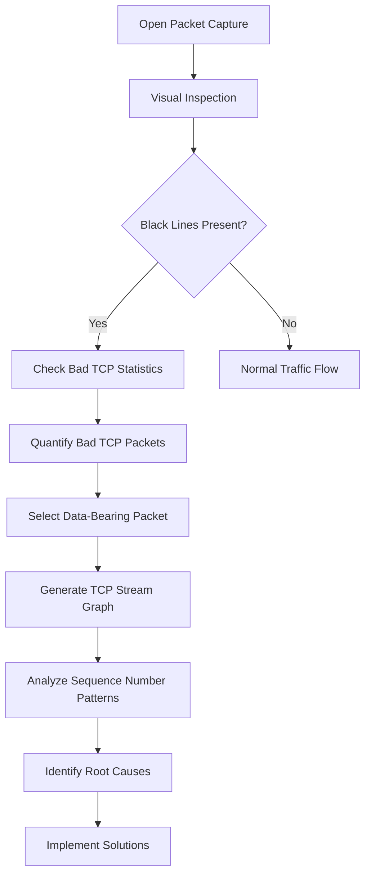
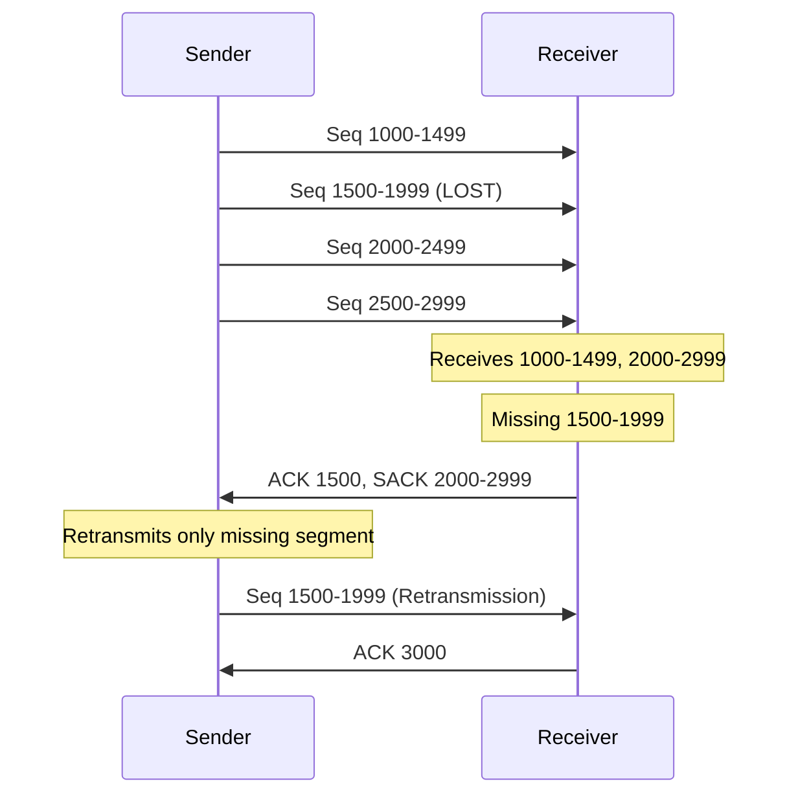
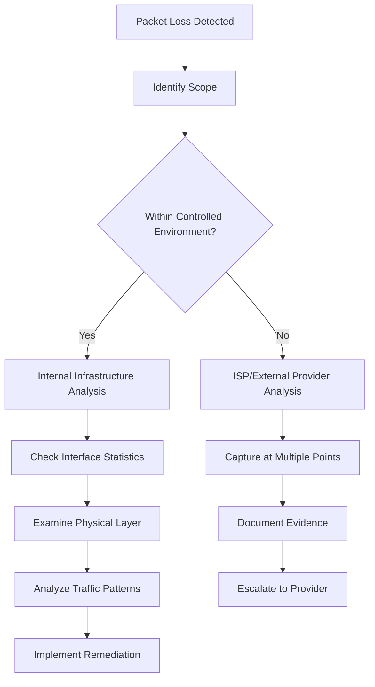

# Case Study: Network Packet Loss Analysis

## Overview

Network packet loss is a critical performance issue that forces TCP to halt transmission, perform retransmissions, and delay application continuation. This document provides a comprehensive workflow for identifying, analyzing, and troubleshooting packet loss using Wireshark.

## Table of Contents

1. [Identifying Packet Loss](#identifying-packet-loss)
2. [Wireshark Analysis Workflow](#wireshark-analysis-workflow)
3. [TCP Stream Graph Analysis](#tcp-stream-graph-analysis)
4. [Understanding SACK Blocks](#understanding-sack-blocks)
5. [Root Cause Analysis](#root-cause-analysis)
6. [Troubleshooting Methodology](#troubleshooting-methodology)

## Identifying Packet Loss

### Visual Indicators in Wireshark

- **Black lines**: Multiple consecutive black lines in the packet list indicate potential packet loss
- **TCP retransmissions**: Flagged packets in the "bad TCP" category
- **Sequence gaps**: Missing sequence numbers in the data stream

### Quantitative Assessment

1. **Navigate to**: `Statistics` → `Bad TCP`
2. **Review metrics**: High counts of bad TCP packets (e.g., ~1,000 packets) indicate significant network issues
3. **Pattern analysis**: Observe if packet loss occurs in bursts or continuously

## Wireshark Analysis Workflow



## TCP Stream Graph Analysis

### Accessing TCP Stream Graphs

1. **Select packet**: Choose any packet containing actual data payload from the server
2. **Navigate to**: `Statistics` → `TCP Stream Graphs` → `TCP Trace`
3. **Interpret results**: Advanced Wireshark feature for visual data flow analysis

### Ideal vs. Problematic Patterns

#### Healthy Network Pattern
```
Sequence Number
     ^
     |     /
     |    /
     |   /
     |  /
     | /
     |/________________> Time

- Unbroken line
- Steep upward slope
- Consistent data flow
```

#### Packet Loss Pattern
```
Sequence Number
     ^
     |     /  /
     |    /  /
     |   /  /  <- Gaps indicate lost packets
     |  /  /
     | /  /
     |/________________> Time

- Broken line with gaps
- Irregular progression
- SACK blocks visible as red bars
```

### Key Performance Indicators

- **Slope steepness**: Higher sequence numbers in less time = better throughput
- **Line continuity**: Unbroken progression indicates healthy transmission
- **Gap presence**: Sequence number gaps represent missing data segments

## Understanding SACK Blocks

### Selective Acknowledgment (SACK) Mechanism

SACK allows receivers to acknowledge successfully received data segments while indicating gaps in the sequence.



### Visual Representation in TCP Trace

- **Red bars**: Represent SACK blocks in Wireshark TCP trace graphs
- **Function**: Show successfully received data beyond sequence gaps
- **Benefit**: Enables efficient retransmission of only missing segments

## Root Cause Analysis

### Primary Causes of Packet Loss

#### 1. Network Congestion

**Definition**: Router or switch cannot process traffic at line rate due to resource limitations.

**Common Scenarios**:
- **Speed mismatches**: 10 Gbps input → 1 Gbps output (choke point)
- **Buffer overflow**: Temporary traffic bursts exceed device capacity
- **CPU overload**: Network device processing limitations

**Identification Methods**:
- Monitor interface utilization statistics
- Check queue depths and drop counters
- Analyze traffic patterns during peak periods

#### 2. Physical Layer Errors

**Definition**: Hardware-related issues causing frame corruption or transmission failures.

**Error Types**:
- **FCS (Frame Check Sequence) errors**: Data corruption during transmission
- **CRC (Cyclic Redundancy Check) errors**: Frame integrity failures
- **Physical medium issues**: Cable degradation, connector problems

**Diagnostic Approach**:
```bash
# Interface error checking workflow
1. Access network device CLI/GUI
2. Check interface statistics:
   - Input/Output errors
   - CRC errors
   - FCS errors
   - Collision counts
3. Examine error trends over time
4. Correlate errors with packet loss incidents
```

#### 3. Hardware Failures

**Components**:
- **Faulty cables**: Physical medium degradation
- **Transceivers**: SFP/SFP+ module failures
- **Network interface cards**: End-device hardware issues

## Troubleshooting Methodology

### Systematic Approach



### Controlled Environment Analysis

1. **Interface Statistics Review**:
   - Router interface error counters
   - Switch port statistics
   - Error rate trends

2. **Physical Infrastructure Audit**:
   - Cable integrity testing
   - Transceiver functionality
   - Connection stability

3. **Traffic Flow Analysis**:
   - Bandwidth utilization patterns
   - Peak usage identification
   - Congestion point location

### External Provider Scenarios

**Challenge**: Limited control over ISP or cloud provider infrastructure.

**Strategy**:
1. **Multi-point capture**: Deploy packet captures on both sides of external links
2. **Evidence documentation**: Maintain detailed loss statistics and timestamps
3. **Provider accountability**: Present quantified data to support service level discussions

**Communication Framework**:
```
Issue: Packet loss affecting application performance
Evidence: X% packet loss during Y time period
Impact: Z seconds additional latency per transaction
Request: Investigation and remediation timeline
```

## Best Practices

### Proactive Monitoring

- **Baseline establishment**: Document normal network performance metrics
- **Threshold alerting**: Configure monitoring for packet loss thresholds
- **Trend analysis**: Regular review of historical performance data

### Reactive Analysis

- **Immediate assessment**: Quick visual inspection of packet captures
- **Quantitative analysis**: Statistical review of error rates
- **Deep dive investigation**: TCP stream graph analysis for detailed patterns

### Documentation Standards

- **Incident timestamps**: Precise timing of packet loss events
- **Quantified impact**: Measurable performance degradation
- **Resolution tracking**: Steps taken and results achieved

## Conclusion

Network packet loss analysis requires a systematic approach combining visual inspection, statistical analysis, and root cause investigation. The key to effective troubleshooting lies in understanding the relationship between TCP behavior, network infrastructure, and application performance. By leveraging Wireshark's advanced features like TCP stream graphs and SACK block visualization, network professionals can quickly identify, quantify, and resolve packet loss issues.

## Related References

- [TCP Retransmission Analysis](Raymond-Notes-17_TCP-Retransmission.md)
- [Practical TCP Analysis](Raymond-Notes-16_Practical-TCP-Analysis.md)
- [Network Latency Case Study](Raymond-Notes-19_Case-Study-High-Network-Latency.md)
