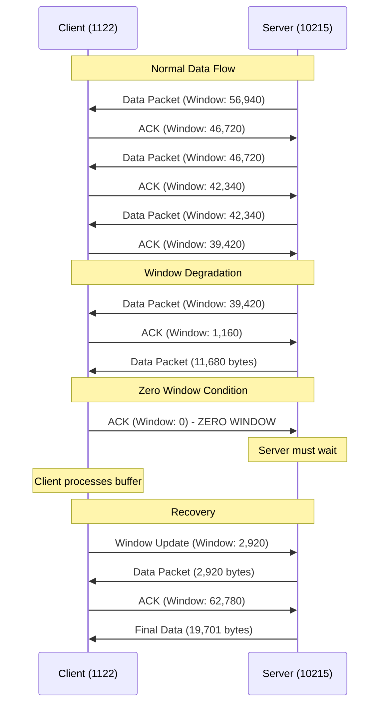

# Case Study: Slow File Transfers - TCP Window Problems

## Overview

This case study demonstrates how TCP window problems can significantly impact network performance, causing slow file transfers and application response times. The scenario involves a client-server communication where the client's TCP receive buffer becomes congested, leading to a zero window condition that forces the sender to wait.

## Key Concepts

### TCP Window Management

The **TCP receive window** is a flow control mechanism that prevents the sender from overwhelming the receiver with data. The receiver advertises its available buffer space to the sender through the window size field in TCP headers.

- **Window Size**: Amount of data the receiver can accept before requiring acknowledgment
- **Calculated Window Size**: Wireshark's computed window size that accounts for window scaling
- **Zero Window**: Condition where the receiver has no available buffer space

### TCP Flow Control Process

1. **Receiver Buffer Management**: The receiver maintains a buffer to store incoming data
2. **Window Advertisement**: Receiver tells sender how much data it can accept
3. **Sender Throttling**: Sender adjusts transmission rate based on advertised window
4. **Buffer Consumption**: Application processes data from the receive buffer
5. **Window Updates**: Receiver sends updates as buffer space becomes available

## Case Study Analysis

### Problem Identification

The analysis focuses on **Lab 12** where TCP window problems were identified through:

- **Packet Navigation**: Jump to packet 1234 using Wireshark's "Go to Packet" feature
- **Conversation Filtering**: Apply TCP conversation filter to isolate relevant traffic
- **Visual Indicators**: Look for black lines indicating "Window Full" conditions

### Traffic Pattern Analysis

**Participants:**
- **Client**: IP address 1122 (receiver experiencing window problems)
- **Server**: Facebook server at IP 10215 (sender)

**Connection Flow:**
1. TCP connection establishment
2. TLS handshake completion
3. Data exchange begins
4. Window size degradation observed
5. Zero window condition reached
6. Recovery and continuation

### Window Size Degradation Pattern

The receiver's advertised window size showed a clear declining pattern:

```
Packet Sequence → Window Size (bytes)
1584 → 56,940
Next → 46,720
Next → 42,340
Next → 39,420
5599 → 1,160
```

### Critical Point Analysis

**Zero Window Event:**
- **Trigger**: Server sends exactly 11,680 bytes (filling remaining window)
- **Duration**: Approximately 41 milliseconds of waiting time
- **Recovery**: Client opens window to 2,920 bytes
- **Impact**: Nearly 1 second of total delay in a 1-second connection

## TCP Window Flow Diagram



## Wireshark Analysis Techniques

### Column Configuration

To effectively analyze TCP window problems:

1. **Remove Unnecessary Columns**: Remove "Time since previous packet" for clarity
2. **Add Calculated Window Size**: Right-click → Add as Column
3. **Focus on Key Metrics**: Monitor window size trends and zero window conditions

### Key Indicators to Monitor

- **Decreasing Window Sizes**: Indicates buffer congestion
- **Zero Window Flags**: Complete buffer exhaustion
- **Window Update Packets**: Recovery mechanisms
- **Time Delays**: Measure impact on performance

## Root Cause Analysis

### Possible Causes of TCP Window Problems

1. **Resource Constraints**:
   - Insufficient system memory
   - CPU overutilization
   - Competing processes

2. **Application Issues**:
   - Slow data processing by receiving application
   - Inefficient buffer management
   - Application-level bottlenecks

3. **System Characteristics**:
   - Older systems with limited resources
   - IoT devices with minimal TCP stack capabilities
   - Systems under heavy load

### Performance Impact Assessment

**Quantitative Metrics:**
- **Delay Duration**: 41ms to ~1 second
- **Throughput Reduction**: Significant during zero window periods
- **Connection Efficiency**: Poor utilization of available bandwidth

**Qualitative Indicators:**
- User-perceived slowness
- Application timeout risks
- Reduced overall system performance

## Troubleshooting Workflow

### Step 1: Identification
1. Open packet capture in Wireshark
2. Navigate to suspected problem area
3. Apply TCP conversation filter
4. Look for window-related annotations

### Step 2: Analysis
1. Configure appropriate columns (Calculated Window Size)
2. Identify communication participants
3. Track window size progression
4. Identify zero window conditions

### Step 3: Assessment
1. Measure delay duration
2. Calculate performance impact
3. Determine root cause category
4. Document findings

### Step 4: Resolution Strategies
1. **Client-side Optimization**:
   - Increase receive buffer sizes
   - Optimize application processing
   - Reduce system load

2. **Network-level Adjustments**:
   - Implement quality of service (QoS)
   - Consider traffic shaping
   - Monitor network utilization

3. **System-level Improvements**:
   - Hardware upgrades
   - Memory optimization
   - Process prioritization

## Best Practices for Prevention

### Proactive Monitoring
- Regular network performance analysis
- Baseline establishment for normal operations
- Automated alerting for anomalous conditions

### System Optimization
- Appropriate buffer sizing
- Application performance tuning
- Resource allocation management

### Capacity Planning
- Anticipate growth requirements
- Plan for peak usage scenarios
- Consider system upgrade schedules

## Conclusion

TCP window problems represent a significant class of network performance issues that can severely impact application responsiveness. Through systematic analysis using Wireshark, network administrators can identify these problems, understand their root causes, and implement appropriate solutions. The key to successful troubleshooting lies in understanding the relationship between TCP flow control mechanisms and system resource availability.

Regular monitoring and proactive system optimization are essential for preventing these issues from impacting user experience and application performance.

---

**Key Takeaways:**
- TCP window problems manifest as decreasing window sizes leading to zero window conditions
- Wireshark provides excellent visibility into TCP flow control mechanisms
- Root causes typically involve resource constraints or application processing inefficiencies
- Systematic analysis and appropriate tooling are essential for effective troubleshooting
