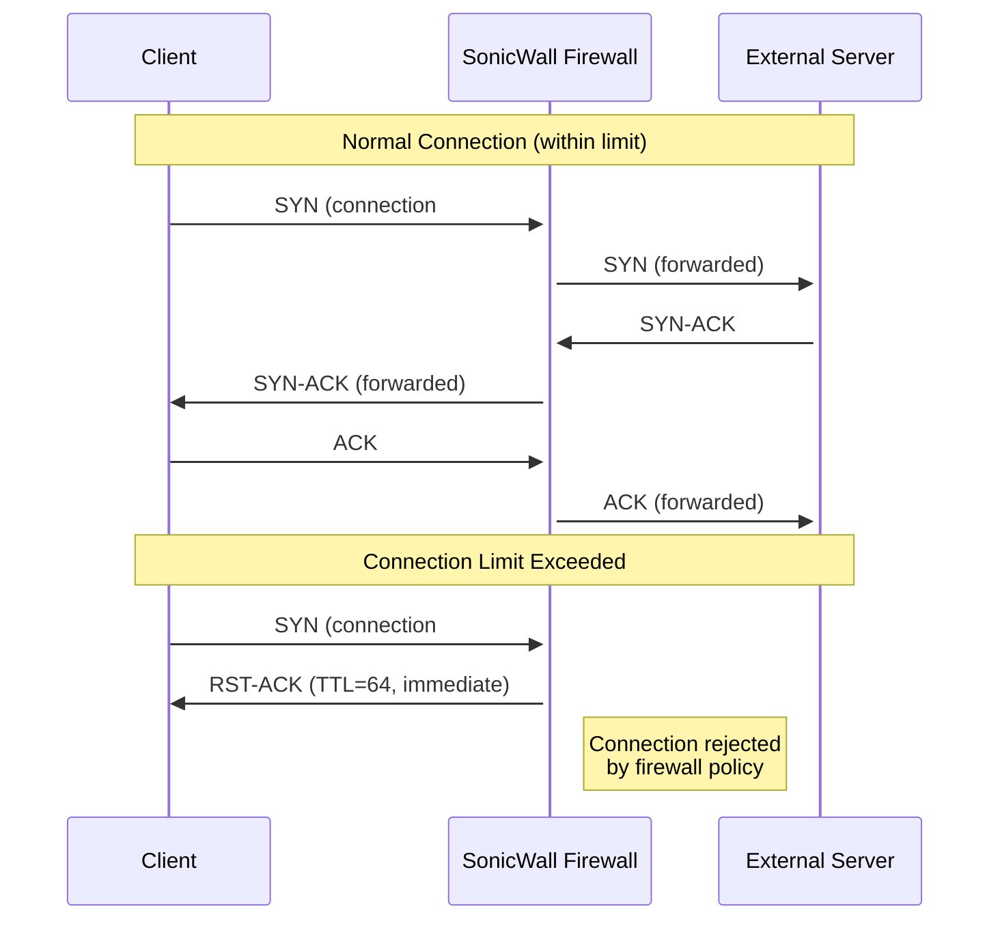
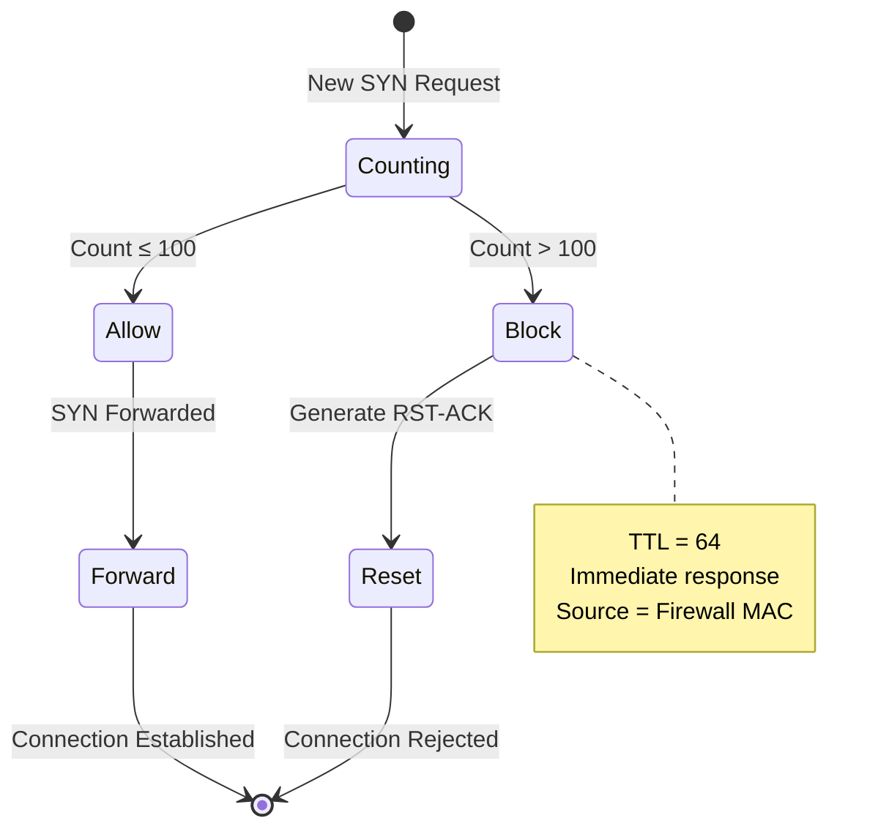

# Case Study: Network Application Disconnects

## Overview

This case study examines a network connectivity issue where applications experience intermittent disconnections, characterized by TCP reset (RST) packets preventing new connection establishment. The root cause was identified as a firewall connection limit configuration that was set too low for the user's legitimate traffic patterns.

## Problem Description

### Symptoms
- **Intermittent connectivity**: Some application connections succeed while others fail
- **Tab behavior**: Existing browser tabs work normally, but new tabs fail to load
- **Connection pattern**: Successful connections to the same servers indicate no server-side blocking
- **Visual pattern**: "Striping" pattern in packet capture showing connection attempts followed by immediate resets

### Network Characteristics
- Client attempting connections to multiple external websites
- Mix of successful and failed connections to the same destinations
- Immediate TCP RST responses to SYN packets
- Very low latency between SYN and RST packets (microseconds)

## Investigation Methodology

### Step 1: Initial Packet Analysis
1. **Identify the Pattern**
   - Look for connection attempt patterns in packet capture
   - Notice "striping" - alternating successful and failed connections
   - Observe that some connections work while others don't to the same destinations

2. **Filter for Reset Packets**
   ```
   tcp.flags.reset == 1
   ```
   - Isolate all TCP reset packets
   - Analyze the source of these resets

### Step 2: TTL Analysis for Reset Source Identification

#### TTL Investigation Process
1. **Remove unnecessary columns** (sequence numbers, acknowledgment numbers)
2. **Add IP TTL column** to packet display
3. **Examine TTL values** of reset packets

#### Key Findings
- **Reset TTL Value**: 64 (consistent across all resets)
- **Implication**: TTL of 64 suggests local origin (unrouted packets)
- **Conclusion**: Resets are not from remote servers but from local network device

### Step 3: Layer 2 Analysis

#### MAC Address Investigation
- Examine source MAC addresses of reset packets
- Compare with legitimate traffic MAC addresses
- Identify the actual originating device

#### Findings
- Reset packets originated from the **SonicWall firewall** (gateway device)
- SonicWall was not just forwarding resets but **generating them**
- Layer 2 analysis confirms local origin of reset packets

## Root Cause Analysis

### Firewall Connection Limiting
- **Parameter**: TCP connections per user
- **Configured Value**: 100 connections per user
- **Default Value**: 500 connections per user
- **Behavior**: 
  - Connections 1-100: Allowed
  - Connection 101+: Reset by firewall
  - New connections only allowed after existing ones close (FIN, RST, or timeout)

### Purpose of Connection Limiting
- **Security Feature**: Prevent botnet activity
- **Protection Target**: Stop end users from being used for:
  - Mass SYN flooding attacks
  - Lateral movement attacks
  - Excessive outbound connections

## Technical Deep Dive

### TCP Connection Reset Analysis



### Packet Analysis Characteristics

| Characteristic | Normal Reset | Firewall-Generated Reset |
|----------------|--------------|-------------------------|
| **TTL Value** | Varies by route | Consistent (64) |
| **Timing** | Variable latency | Microsecond response |
| **Source MAC** | Varies | Always firewall MAC |
| **Pattern** | Sporadic | Threshold-based |

### Connection State Tracking



## Diagnostic Techniques

### Essential Wireshark Filters

1. **TCP Reset Analysis**
   ```
   tcp.flags.reset == 1
   ```

2. **Connection Attempts Analysis**
   ```
   tcp.flags.syn == 1 and tcp.flags.ack == 0
   ```

3. **Conversation Filtering**
   ```
   Right-click → Conversation Filter → TCP
   ```

### Key Columns for Analysis
- **Remove**: Sequence numbers, ACK numbers (reduce noise)
- **Add**: IP TTL (identify packet origin)
- **Examine**: Source/Destination MAC addresses

### Timing Analysis
- **Microsecond delays**: Indicate local processing
- **Variable delays**: Suggest network routing
- **Consistent patterns**: Point to policy enforcement

## Resolution Process

### Step 1: Device Identification
- Use TTL analysis to identify local reset source
- Examine MAC addresses to confirm originating device
- Access device management interface

### Step 2: Configuration Review
- Locate connection limiting parameters
- Compare current settings with defaults
- Assess legitimate traffic requirements

### Step 3: Vendor Consultation
- Engage firewall vendor support
- Provide traffic analysis and resource utilization data
- Obtain recommended configuration values

### Step 4: Configuration Adjustment
- Increase TCP connections per user limit
- Test with incremental increases
- Monitor for both connectivity improvement and security impact

## Prevention and Best Practices

### Monitoring Recommendations
1. **Regular TTL Analysis**: Monitor for consistent TTL values in error packets
2. **Connection Pattern Monitoring**: Watch for artificial connection limits
3. **Layer 2 Analysis**: Verify packet origins using MAC addresses
4. **Baseline Establishment**: Capture both working and non-working scenarios

### Configuration Guidelines
1. **Default Settings**: Start with vendor-recommended defaults
2. **Traffic Analysis**: Monitor legitimate user connection patterns
3. **Gradual Adjustment**: Make incremental changes with monitoring
4. **Documentation**: Record all configuration changes and rationale

### Security Considerations
- **Balance**: Security protection vs. user functionality
- **Monitoring**: Watch for actual botnet/attack patterns
- **Alerting**: Implement alerts for unusual connection patterns
- **Regular Review**: Periodically assess connection limits against usage patterns

## Key Takeaways

### Technical Lessons
1. **TTL Analysis**: Powerful technique for identifying packet origins
2. **Layer 2 Importance**: MAC address analysis reveals true packet sources
3. **Pattern Recognition**: Visual patterns in packet captures indicate systematic issues
4. **Multiple Protocols**: Consider all network layers in analysis

### Investigative Approach
1. **Systematic Filtering**: Use targeted filters to isolate relevant traffic
2. **Comparative Analysis**: Compare working vs. non-working scenarios
3. **Device-Centric Investigation**: Follow evidence to specific network devices
4. **Vendor Engagement**: Leverage vendor expertise for complex configurations

### Operational Insights
1. **Default vs. Custom**: Custom configurations may not suit all environments
2. **Documentation**: Understanding the purpose of security features is crucial
3. **Testing**: Always test configuration changes in controlled manner
4. **Monitoring**: Continuous monitoring prevents recurrence of similar issues

## Related Concepts

- **TCP Connection States**: Understanding SYN, RST, FIN sequences
- **Firewall Stateful Inspection**: How firewalls track connection states
- **Network Security Policies**: Balance between security and functionality
- **Packet Analysis Fundamentals**: TTL, MAC addressing, timing analysis
