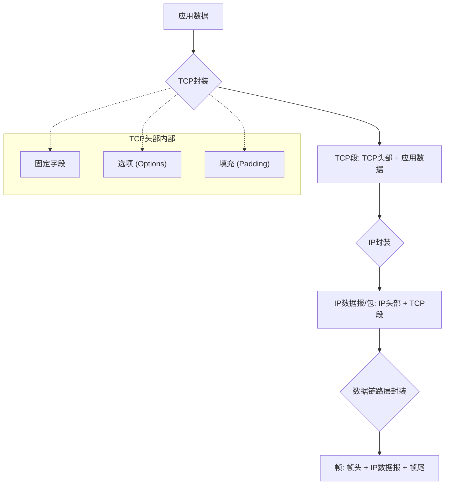
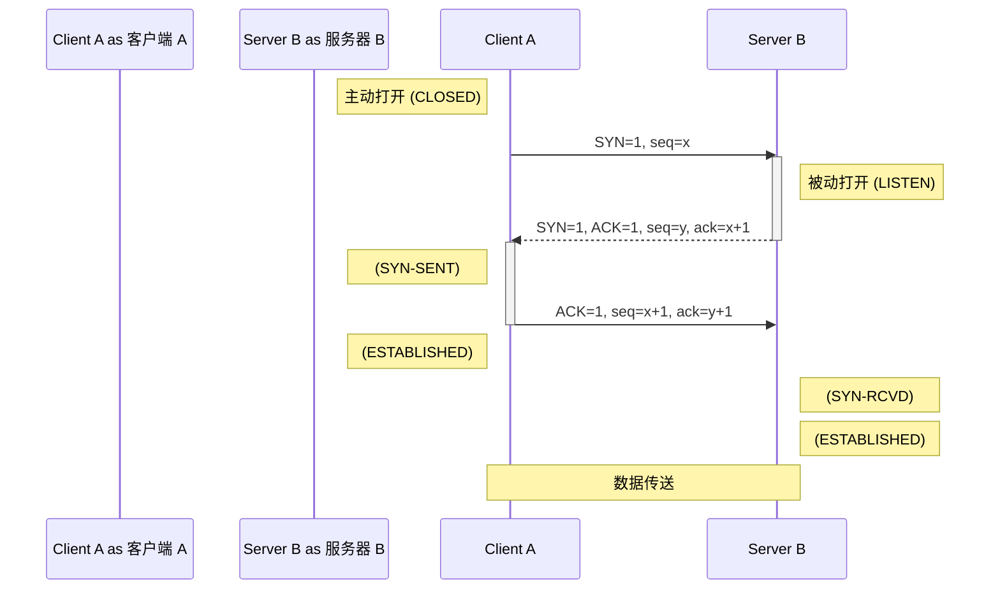
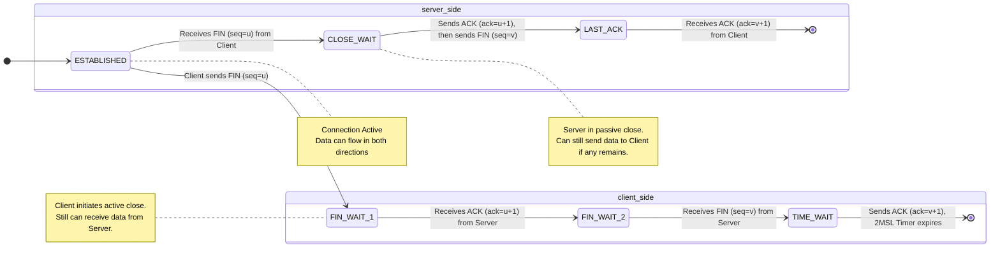

# 学习Wireshark时，复习一下TCP/IP (Raymond专用笔记)

这份笔记总结了我们在学习Wireshark和复习TCP/IP概念时的主要问答和关键点。

## 1. TCP头部格式解读

**问题：** 图片中的"16位"、"32位"、"4位"等在TCP协议中有什么含义？

**回答：**
这些"位"指的是TCP头部中各个字段的长度，以比特（bit）为单位。比特是计算机中数据的最小单位，值为0或1。

* **16位 (16-bit):** 字段占据16比特。例如：
    * 源端口号 (Source Port): $2^{16} = 65,536$ 个可能值 (0-65535)。
    * 目的端口号 (Destination Port): 同上。
* **32位 (32-bit):** 字段占据32比特。例如：
    * 序号 (Sequence Number): $2^{32}$ 个可能值，用于标识数据包顺序。
    * 确认序号 (Acknowledgment Number): 同上，用于确认收到的数据。
* **4位 (4-bit):** 字段占据4比特。例如：
    * 首部长度 (Header Length): 表示TCP头有多少个32位字（4字节）。$2^4 = 16$ 个可能值。最小为5（20字节，无选项），最大为15（60字节）。

**问题：** 图中的"选项"、"填充"、"数据"没有标明多少位，为什么？它们不属于TCP header吗？

**回答：**
* **"选项 (Options)" 和 "填充 (Padding)"：**
    * **是TCP头部的一部分。**
    * **长度可变：**
        * **选项：** 可以包含MSS、窗口缩放、SACK、时间戳等。其有无和长度不定。
        * **填充：** 用0比特填充，确保TCP头部的总长度是32位（4字节）的整数倍。填充长度取决于选项长度。
    * TCP头部的“首部长度”字段指明了包括选项和填充在内的整个头部的实际长度。

* **"数据 (Data)"：**
    * **不是TCP头部的一部分。**
    * 它是TCP段的**净荷 (Payload)**，即实际传输的应用层数据。其长度可变，受MSS等因素限制。

```mermaid
graph LR
    subgraph TCP Segment
        A[TCP Header] --- B[TCP Payload (数据 Data)]
    end

    subgraph TCP Header
        SourcePort["源端口号 (16位)"]
        DestPort["目的端口号 (16位)"]
        SeqNum["序号 (32位)"]
        AckNum["确认序号 (32位)"]
        HeaderLen["首部长度 (4位)"]
        Reserved["保留 (6位)"]
        Flags["标志 (URG, ACK, PSH, RST, SYN, FIN) (6位+)"]
        WindowSize["接收窗口 (16位)"]
        Checksum["校验和 (16位)"]
        UrgentPointer["紧急指针 (16位)"]
        Options["选项 (长度可变)"]
        Padding["填充 (长度可变, 0-3字节)"]
    end

    %% Simplified connections for overview
    HeaderLen --> Options;
    Options --> Padding;
```

## 2. 核心网络概念关系：封装

**问题：** TCP segment, IP datagram, "选项"、"填充"这样的component, packet 这些逻辑概念之间的关系是怎样的？

**回答：**
核心关系是**封装 (Encapsulation)**。

1.  **应用数据 (Application Data):** 应用程序要发送的原始信息。
2.  **TCP段 (TCP Segment):**
    * 传输层 (Layer 4) 的数据单元。
    * 组成：**TCP头部** + **TCP净荷 (应用数据)**。
    * TCP头部包含“选项”和“填充”。
3.  **IP数据报 (IP Datagram) / 包 (Packet):**
    * 网络层 (Layer 3) 的数据单元。通常所说的“包 (Packet)”在TCP/IP中常指IP数据报。
    * 组成：**IP头部** + **IP净荷 (整个TCP段)**。
4.  **帧 (Frame):**
    * 数据链路层 (Layer 2) 的数据单元 (例如：以太网帧)。
    * 组成：**帧头部** + **帧净荷 (整个IP数据报)** + **帧尾部 (可选，如FCS)**。


*(Mermaid图简化了头部内具体字段，重点展示封装层次)*

**总结：**
* "选项"和"填充"是TCP头部内的组件。
* TCP段 = TCP头部 + 应用数据。
* IP数据报/包 = IP头部 + TCP段。

## 3. 网络模型分层与数据长度

**问题：** TCP Segment就是由TCP Header以及TCP Payload这2个部分组成的咯？应用层是layer 7吗？既然TCP Segment是layer 4，IP Datagram是layer 3，那layer 5, 6去哪里了？IP Datagram和TCP Segment 有最大长度吗？

**回答：**
1.  **TCP Segment组成：** 是的，TCP Segment = TCP Header + TCP Payload (应用数据)。
2.  **网络模型分层：**
    * 您提到的Layer 7 (应用层), Layer 5 (会话层), Layer 6 (表示层) 属于 **OSI七层模型**。
    * TCP/IP通常使用**四层模型**（或五层）：
        1.  网络接口层 (Link Layer)
        2.  网际层 (Internet Layer - IP在此，对应OSI Layer 3)
        3.  传输层 (Transport Layer - TCP/UDP在此，对应OSI Layer 4)
        4.  应用层 (Application Layer - 包含了OSI的 Layer 5, 6, 7的功能)
    * 所以，OSI的Layer 5和Layer 6的功能在TCP/IP模型中被整合到了其应用层。

    ```mermaid
    graph TD
        subgraph OSI七层模型
            O7[L7: 应用层] --> O6[L6: 表示层] --> O5[L5: 会话层] --> O4[L4: 传输层] --> O3[L3: 网络层] --> O2[L2: 数据链路层] --> O1[L1: 物理层]
        end
        subgraph TCP/IP四层模型
            T4[应用层] --> T3[传输层] --> T2[网际层] --> T1[网络接口层]
        end

        T4 -.-> O7
        T4 -.-> O6
        T4 -.-> O5
        T3 -.-> O4
        T2 -.-> O3
        T1 -.-> O2
        T1 -.-> O1
        classDef note fill:#f9f,stroke:#333,stroke-width:1px;
        class T4,O7,O6,O5,T3,O4,T2,O3,T1,O2,O1 note;
    ```

3.  **最大长度：**
    * **IP数据报 (IPv4):**
        * 头部“总长度”字段16位，理论最大 $2^{16} - 1 = 65,535$ 字节。
        * 实际受限于**MTU (Maximum Transmission Unit)**，如以太网MTU通常为1500字节。超过MTU需分片。
    * **TCP段 (TCP Segment):**
        * 作为IP数据报的净荷，其最大长度受IP数据报最大长度限制。
        * TCP头部本身20-60字节。
        * 理论最大TCP数据约 $65535 - 20 (\text{IP头}) - 20 (\text{TCP头}) = 65495$ 字节。
        * 实际数据长度由**MSS (Maximum Segment Size)**协商决定，通常 MSS = MTU - IP头长 - TCP头长 (例如 $1500 - 20 - 20 = 1460$ 字节)，目的是避免IP分片。

## 4. Wireshark中的Packet List

**问题：** 我在Wireshark中加载了一个".pcapng"文件，在Wireshark中就能看到"packet list"，那么每个packet 就是一个IP Datagram，我可以这么理解吗？

**回答：**
**基本正确，尤其是在观察到IP地址时。**

* Wireshark捕获的是数据链路层的“**帧 (Frame)**”。
* 对于绝大多数互联网通信，帧的净荷是**IP数据报 (IP Datagram)**。
* Wireshark的Packet List中的每一行代表一个捕获的帧，并智能解析显示IP层及以上的信息。
* **例外：** Wireshark也可能捕获非IP流量，如ARP包，这些就不是IP数据报。
* 您的截图中显示了IP地址和端口号，表明这些packet确实承载IP数据报。

## 5. TCP三次握手图的类型

**问题：** (用户提供TCP三次握手图) 关于这个截图，你认为可以称呼为什么类型的diagram？

**回答：**
最适合的称呼是：
1.  **时序图 (Sequence Diagram):** 清晰展示了参与者间按时间顺序的消息交互。
2.  **消息顺序图 (Message Sequence Chart - MSC):** 特别是在电信和协议工程领域，准确描述组件间消息交换顺序。
3.  **协议交互图 (Protocol Interaction Diagram):** 通用但准确。
4.  结合了**状态转换 (State Transition)** 的表现形式：图中也标出了状态变化。



## 6. 网络术语："报文"与"报文段"

**问题：** "报文"是什么意思？是TCP Segment的意思吗？"报文段"又是什么意思？

**回答：**
* **"报文 (bàowén)"：**
    * 通用术语，指网络中传输的格式化数据单元，广义上的"Message"或"Datagram"。
    * 具体含义依协议层次而定 (应用层消息、IP数据报、UDP数据报等都可算报文)。
    * 一个TCP Segment可被视为一种报文，但“报文”不专指TCP Segment。
* **"报文段 (bàowénduàn)"：**
    * 特指 **"Segment"**。
    * 在TCP/IP中，**"TCP报文段" 准确对应 "TCP Segment"**。
* **上下文：** 在TCP三次握手图中，客户端和服务器交换的是TCP段 (TCP Segments)。有时文档会用“数据包”或“报文”泛指，但“TCP报文段”最精确。

## 7. ESTABLISHED状态下的TCP标志位

**问题：** 假设客户端和服务端进入了"ESTABLISHED"状态。那么，此后无论是由客户端还是服务端发送的TCP Segment，其中的header中的标志位都是一样的吗？

**回答：**
**不是的，标志位并不总是完全一样。**

* **ACK标志位：** 在ESTABLISHED状态下，**几乎所有**的TCP段都会将ACK位置为1 (用于确认收到对方数据)。
* **PSH (Push) 标志位：** 当发送方希望接收方TCP层立即将数据递交给应用层时设置。**不是每个段都会设置**，取决于发送方应用需求。
* **URG (Urgent) 标志位：** 指示段中包含紧急数据。**很少使用。**
* **FIN (Finish) 标志位：** 当一方希望关闭连接时发送。在正常数据交换中为0，准备关闭时才为1。
* **SYN (Synchronize) 标志位：** 用于连接建立。在ESTABLISHED状态下正常数据段中为0。
* **RST (Reset) 标志位：** 用于异常中止连接。在正常数据交换中为0。

**总结：** ACK位几乎总是1，PSH位可能变化，其他位在正常数据传输中通常为0。

## 8. 传输控制块 (TCB)

**问题：** 传输控制块(TCB)是什么东西？它位于哪里？在header中？

**回答：**
* **是什么：** TCB (Transmission Control Block) 是一个**操作系统内核数据结构**。它为每一个活动的TCP连接维护所有关键信息和状态。
    * 包含：本地/远端IP和端口、连接状态 (ESTABLISHED, TIME_WAIT等)、序号、确认号、窗口大小、定时器、RTT估计、拥塞控制参数、协商的选项(MSS等)等。
* **位于哪里：** 位于**操作系统内核的内存空间中**。每个TCP连接在通信双方的内核中都有一个对应的TCB。
* **在header中吗：** **不，TCB绝对不在TCP头部中。**
    * TCP头部是在网络上传输的控制信息，其字段值很多是从TCB中提取或计算的。
    * TCB是本地的、内部的管理结构，远比TCP头部复杂和庞大。

```mermaid
graph LR
    subgraph OS Kernel Space (Host A)
        TCB_A["TCB for Connection X (Client A)"]
        App_A["Application A (User Space)"] -- Socket API --> Kernel_A["TCP/IP Stack (Host A)"]
        Kernel_A -- Manages --> TCB_A
        TCB_A -- Populates --> Header_Out_A["Outgoing TCP Segment Header"]
        Header_In_A["Incoming TCP Segment Header"] -- Updates --> TCB_A
        Kernel_A -- Sends/Receives --> Network_A["Network Interface"]
    end
    subgraph OS Kernel Space (Host B)
        TCB_B["TCB for Connection X (Server B)"]
        App_B["Application B (User Space)"] -- Socket API --> Kernel_B["TCP/IP Stack (Host B)"]
        Kernel_B -- Manages --> TCB_B
        TCB_B -- Populates --> Header_Out_B["Outgoing TCP Segment Header"]
        Header_In_B["Incoming TCP Segment Header"] -- Updates --> TCB_B
        Kernel_B -- Sends/Receives --> Network_B["Network Interface"]
    end
    Network_A <--> Network_B
```
*(简化示意图，展示TCB在内核中管理连接并与头部信息交互)*

**问题：** 假设有一个Python或Go开发者，这个人是一名web app开发者，这个人什么场景下会需要与TCB交互？

**回答：**
Web应用开发者**几乎从不，也无法直接与TCB交互或操作**。TCB是内核管理的对象。

开发者通过更高级别的接口（Socket API）间接影响TCB：

1.  **连接管理：** `connect()`, `listen()`, `accept()`, `close()` 等操作会触发内核创建、改变状态、销毁TCB。不当的连接管理可能导致`TIME_WAIT`状态TCB过多。
2.  **设置Socket选项：**
    * `TCP_NODELAY` (禁用Nagle算法): 影响TCB中数据发送缓冲策略。
    * `SO_KEEPALIVE` (TCP保活): 涉及TCB中的保活定时器。
    * 缓冲区大小 (`SO_SNDBUF`, `SO_RCVBUF`): 影响TCB中记录的窗口大小。
    这些选项通过`setsockopt`等API调用，由内核调整对应TCB的参数。
3.  **性能调优与问题诊断：** 理解TCP机制（拥塞控制、流控等，都由TCB管理）对诊断性能瓶颈重要。使用`netstat`, `ss`等工具看到的信息源于内核TCB。
4.  **处理网络错误：** 应用收到的网络错误（超时、重置）是TCP协议栈（通过TCB）检测到异常后通知的。

**总结：** 开发者是TCB所管理行为的“用户”和“影响者”，而非直接“操纵者”。

**问题：** 你提到的"TCP_NODELAY"、"SO_KEEPALIVE"这些属于Socket API的选项，对吧？那么，这些选项会体现在TCP Segment中吗？

**回答：**
1.  **是的，它们是Socket API选项。**
2.  **这些选项本身不直接作为特定标志位体现在每个TCP Segment头部中。** 它们主要控制本地TCP协议栈的行为。
    * **`TCP_NODELAY`：** 影响发送方TCP如何将数据打包成段（时机、大小），不改变头部字段。启用后可能发送更多、更小的段。
    * **`SO_KEEPALIVE`：** 启用后，若连接空闲，本地TCP会发送“保活探测包”（本身是TCP段，通常是空ACK段）。它触发了特定段的发送，但不是在常规数据段头部加标记。
    * **区分：** TCP头部中的“选项字段”可以携带双方协商的TCP协议选项（如MSS, SACK, Timestamps），这些会出现在段中。Socket API选项更多是本地行为控制。

## 9. TCP四次挥手（断开连接）

**问题：** (用户提供TCP四次挥手图) ... "seq = v"、"ack = u + 1"，其中的"seq"和"ack"是否就是TCP Segment中的header中的"序号(32位)"和"确认序号(32位)"？

**回答：**
**是的，完全正确。**
* 图中的 **"seq = v"** 指的是该TCP Segment头部中的 **"序号 (Sequence Number)"** 字段的值。
* 图中的 **"ack = u + 1"** 指的是该TCP Segment头部中的 **"确认序号 (Acknowledgment Number)"** 字段的值。
    (例如，服务器ACK客户端的FIN(seq=u)时，ack=u+1，因为FIN消耗一个序号)。

**问题：** TCP连接的断开(4-way handshake)过程中，是否从客户端或者服务端任意一方都可以开始？

**回答：**
**是的，可以由客户端或服务器任意一方首先发起。**
TCP连接是全双工的，一旦连接建立，关闭连接的操作上双方地位平等。任何一方数据发送完毕，就可发送第一个FIN报文段，启动四次挥手。


*(这是一个简化的状态图，实际状态更复杂，且TIME_WAIT通常在主动关闭方)*

**问题：** 图片中的"等待 2 MSL"这个描述的"MSL"是一个时间单位还是以"次数"或"数据长度"为衡量的？

**回答：**
**MSL (Maximum Segment Lifetime，最大报文段生存时间) 是一个时间单位。**
* 它指TCP报文段被允许在互联网中存活的最长时间，通常以秒为单位 (常见值30s, 60s, 120s)。
* `TIME_WAIT`状态等待`2 * MSL`时长，目的是：
    1.  确保对方收到最后的ACK（若ACK丢失，对方会重传FIN，`TIME_WAIT`方可重发ACK）。
    2.  防止旧连接的延迟报文段干扰使用相同IP和端口的新连接。

**问题：** 如何更改MSL？

**回答：**
更改MSL或`TIME_WAIT`时长 (2MSL) 是**操作系统级别**的内核参数调整，**不推荐常规操作，风险很高**。可能导致连接关闭不可靠、旧数据干扰新连接。优先考虑应用层优化（连接池）或更安全的内核参数（如Linux的`tcp_tw_reuse`）。

* **Linux：** `TIME_WAIT`时长通常硬编码为60秒 (MSL为30秒)，无简单`sysctl`直接修改。`net.ipv4.tcp_fin_timeout`是`FIN_WAIT_2`时长。`net.ipv4.tcp_tw_reuse=1`可允许在安全前提下为新出站连接重用`TIME_WAIT`套接字。
* **Windows：** 注册表 `HKLM\SYSTEM\CurrentControlSet\Services\Tcpip\Parameters` -> `TcpTimedWaitDelay` (DWORD, 秒)，直接设定2MSL时长，默认通常120秒。需重启。
* **macOS：** `sysctl net.inet.tcp.msl` (毫秒)，默认15000ms (MSL=15s, 2MSL=30s)。可临时或永久修改。
* **FreeBSD：** `sysctl net.inet.tcp.msl` (毫秒)，默认30000ms (MSL=30s, 2MSL=60s)。

## 10. TCP半连接队列和全连接队列

**问题：** 半连接队列和全连接队列位于哪里？他们位于TCB(Transmission Control Block)当中吗？

**回答：**
* **位置：** 都位于**操作系统内核的内存空间中**，与服务器端处于`LISTEN`状态的套接字相关联。
* **与TCB的关系：**
    * 队列本身不是位于“一个”TCB中。
    * **半连接队列 (SYN Queue)：** 存储处于TCP三次握手第一步之后（收到SYN，发出SYN-ACK，等待客户端ACK，状态为`SYN_RCVD`）的连接请求。队列中的每个条目对应一个临时的、不完整的TCB（或类似轻量结构，如Linux的`request_sock`）。
    * **全连接队列 (Accept Queue)：** 存储已经完成三次握手，连接已完全建立 (`ESTABLISHED`)，等待被应用程序通过`accept()`系统调用取走的连接。队列中的每个条目代表一个已建立的连接，内核为其维护了一个完整的TCB。`accept()`调用返回的新套接字关联此TCB。
    * 监听套接字本身也有一个TCB（状态为`LISTEN`），这两个队列逻辑上附属于它。

```mermaid
graph TD
    Client -->|1. SYN| S_Listen[Listening Socket (Kernel)];

    subgraph Kernel Space (Server)
        S_Listen -->|If SYN Queue not full| SYN_Queue[半连接队列 (SYN Queue)];
        SYN_Queue -->|Creates temp TCB-like struct<br>Sends SYN-ACK| SYN_RCVD_State{Connection in SYN_RCVD};
        Client -->|3. ACK| SYN_RCVD_State;
        SYN_RCVD_State -->|Moves to ESTABLISHED<br>Promotes to full TCB| Accept_Queue[全连接队列 (Accept Queue)];
        App["Application (User Space)"] -->|accept() call| Accept_Queue;
        App --> Established_Conn[New Socket for Established Connection (with full TCB)];
    end

    note right of SYN_Queue
      Stores info for connections
      awaiting final ACK of 3-way handshake.
      Each entry has a minimal TCB-like structure.
    end note

    note right of Accept_Queue
      Stores fully established connections
      waiting for application to accept().
      Each entry references a full TCB.
    end note
```

## 11. ISN (Initial Sequence Number)

**问题：** "ISN 可以看作是一个 32 比特的计数器，每 4ms 加 1"。这是为什么？即使客户端与服务端之间没有发送TCP Segment，ISN也会增加吗？ISN不是随着每发送一个segment就递增1吗？

**回答：**
这句话描述的是一种**生成ISN的策略**，目的是使新连接的ISN独特且不可预测，以防止旧连接的延迟报文段干扰新连接，并增加安全性。

1.  **"为什么每4ms加1"：**
    * 这是指主机用于**生成新的ISN**的一个底层、全局的、基于时间的计数器机制。RFC 793建议这个计数器约每4微秒(µs)递增，文本中的“4ms”可能是简化或特定实现。核心思想是ISN的生成包含一个随时间稳定增长的组件。
2.  **"即使没有发送TCP Segment，ISN也会增加吗？"：**
    * 是的，这个用于**生成未来ISN的底层全局计数器**会持续增加，与当前是否有连接或数据段发送无关。
    * 它影响的是**未来新连接**的ISN选择。一旦一个连接的ISN选定，该连接的ISN就固定了。
3.  **"ISN不是随着每发送一个segment就递增1吗？"：**
    * **这是对ISN和数据传输中序列号的混淆。**
        * **ISN (初始序列号)：** 是连接**建立时**双方各自选择的起始序列号，每个连接只确定一次。
        * **TCP Segment中的序列号：** 连接建立后，发送数据时，头部“序号”字段指该段第一个数据字节在整个数据流中的序号。它是从ISN开始，根据**发送的字节数**累加，而不是每段+1。SYN和FIN标志也会消耗一个序号。

## 12. EDF Object Store `put object` 失败排查 (AWS CLI vs mc)

**问题：** (详细描述了EDF Object Store中，使用admin权限，`mc` put object成功，但AWS CLI put object失败，即使小文件也失败，而list/get成功的情况) 你觉得会是什么原因？

**回答：**
问题通常在于AWS CLI执行`PUT`时与`mc`或其执行`GET/LIST`时的细微差异，或EDF Object Store（基于MinIO）对这些特定`PUT`请求的处理方式。

**可能原因及排查方向：**

1.  **HTTP `Expect: 100-continue` 头部：** AWS CLI常为PUT发送此头部，等待服务器`100 Continue`响应。S3兼容存储可能处理不当。`mc`或`GET/LIST`可能不使用。
    * **排查：** `aws ... --debug` 查看有无此头部及服务器响应。
2.  **寻址方式 (Path-style vs. Virtual-hosted style)：** AWS CLI默认或自动检测的寻址方式可能与EDF期望的不同。MinIO常需特定配置支持virtual-hosted。
    * **排查：** AWS CLI配置中尝试明确设置 `s3.addressing_style = path` (或 `virtual`)。
3.  **签名版本 (Signature Version)：** 应为SigV4。确认AWS CLI配置。
4.  **`Content-MD5` 头部：** AWS CLI通常计算并发送。EDF可能校验有问题。
    * **排查：** `aws ... --debug` 查看。
5.  **分块上传 (Multipart Upload)：** 小文件一般不触发，但行为可能与`mc`不同。
    * **排查：** `aws ... --debug` 查看有无分块API调用。
6.  **SSL/TLS 问题：** 虽然`GET/LIST`成功，但`PUT`的TLS处理路径可能略有不同。
    * **排查：** `aws ... --debug`，服务端证书及TLS日志。`--no-verify-ssl` (仅测试)。
7.  **EDF Object Store (MinIO) 服务端日志和版本：** **最重要步骤之一。** 查看服务端对失败PUT请求的详细日志。检查MinIO版本有无相关已知bug。
8.  **AWS CLI 版本和依赖：** 尝试更新或回退AWS CLI。

**问题：** 在这个特定的问题上，假设最终通过`tcpdump`捕获put开始前到失败之后的packet capture，那么正确的troubleshooting做法是怎样的？在client端(AWS CLI)和server端(EDF Object Store)都需要捕获packet capture吗？

**回答：**
**理想情况：客户端和服务端都抓包。**
* **客户端抓包：** 看AWS CLI实际发出什么，收到什么。
* **服务器端抓包：** 看服务器实际收到什么，如何响应。
* **关联分析：** 对比两端，看丢包、谁先断开等。确保时间同步。
* 若只能一端，优先客户端。

**`tcpdump` 排查步骤 (用Wireshark分析)：**
1.  **准备：** 最小化背景流量，设置好过滤器 (IP, 端口)，抓完整包 (`-s0`)，记录到文件 (`-w file.pcap`)。同步启停抓包和命令。
2.  **分析：**
    * **TCP三路握手：** 是否成功？ (对该会话)
    * **TLS/SSL握手 (若HTTPS)：** 是否成功？有无Alert？证书问题？
    * **HTTP交互 (若TLS解密成功或为HTTP)：**
        * 客户端`PUT`请求的完整头部 (Host, Authorization, Content-Length/Type/MD5, Expect: 100-continue, x-amz-* 等)。
        * 服务器对`Expect: 100-continue`的响应？
        * 客户端是否发送了HTTP Body (对象数据)？
        * 服务器最终HTTP状态码和响应体错误信息？
    * **TCP层连接终止/异常：**
        * 谁先发FIN或RST？时机？
        * 有无大量TCP重传、零窗口？
    * **对比：** 与成功的 `mc put` 或 AWS CLI `get object` 的抓包进行详细对比。

**问题：** (补充信息：single-node EDF cluster在公司内网，通过proxy+Zscaler访问互联网。AWS CLI在集群本机，已正确设置NO_PROXY访问本机Object Store) 在这种情况下，`tcpdump`捕获的packet capture中会看到Zscaler的字样吗？

**回答：**
**大概率不会，理论上不应该看到。**

* 因为AWS CLI与本机Object Store的通信是**本地通信**。
* 如果`NO_PROXY`正确配置并生效，这部分流量会**直接发送到本机Object Store服务，绕过外部proxy和Zscaler**。
* `tcpdump`中应主要看到源/目标IP为本机IP或`127.0.0.1`。
* **在什么情况下可能“间接”看到Zscaler（但非直接通信路径）：**
    1.  **`NO_PROXY`配置错误/未生效：** 流量错误地走了proxy -> Zscaler。此时：
        * `tcpdump`会看到与内部proxy的通信。
        * 若Zscaler做SSL解密，TLS证书可能来自Zscaler。
        * HTTP头中可能被Zscaler注入`Via`或`X-Zscaler-*`头。
    2.  **DNS解析问题：** 若Object Store endpoint依赖外部DNS解析且该DNS走了proxy/Zscaler（不太可能用于本地服务）。
* **结论：** 对于AWS CLI与**同一节点上**的EDF Object Store的直接通信，如果`NO_PROXY`工作正常，抓包中**不应看到Zscaler的IP、证书或相关HTTP头。**
