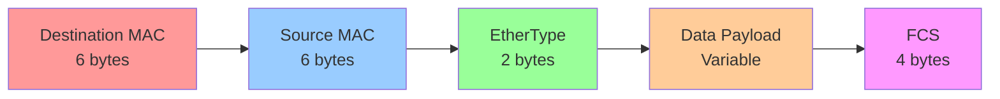
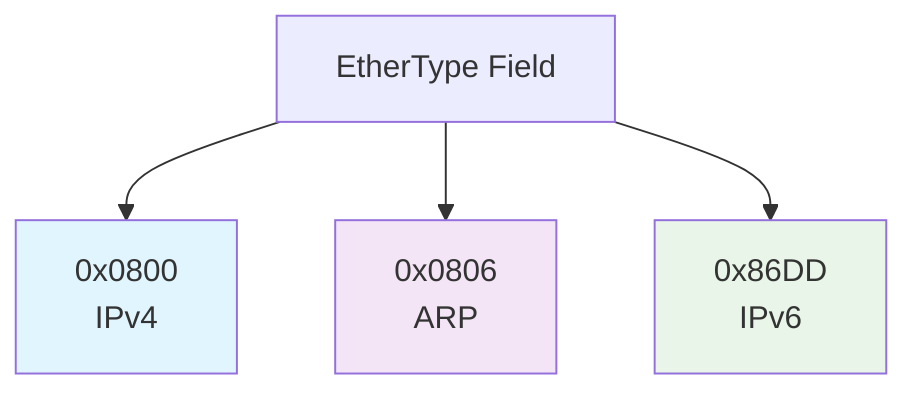
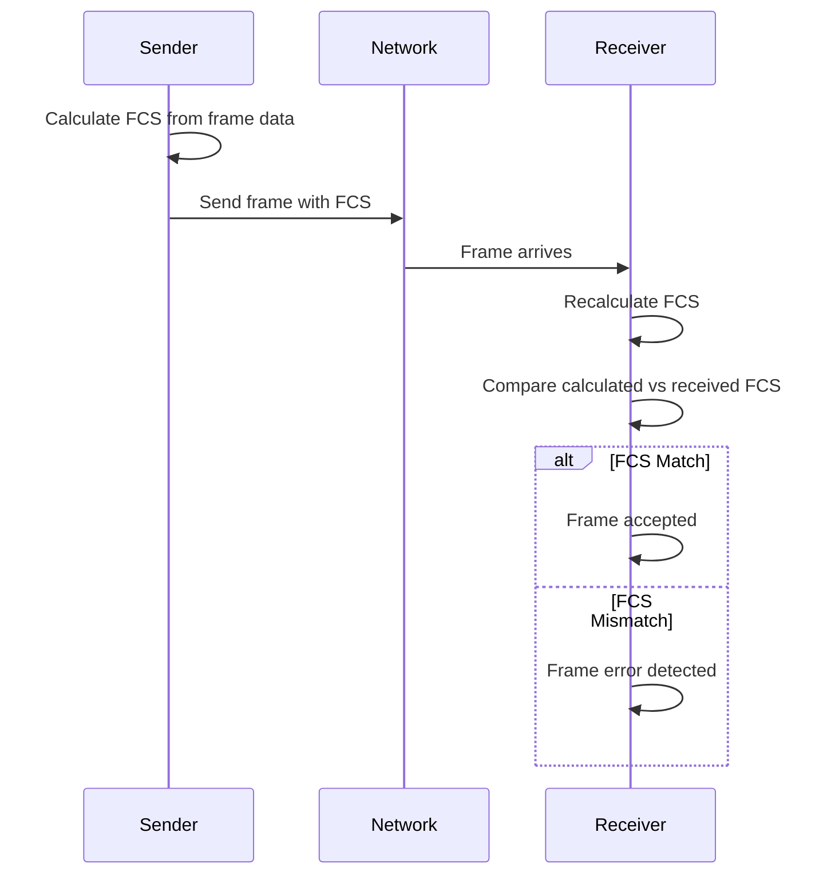
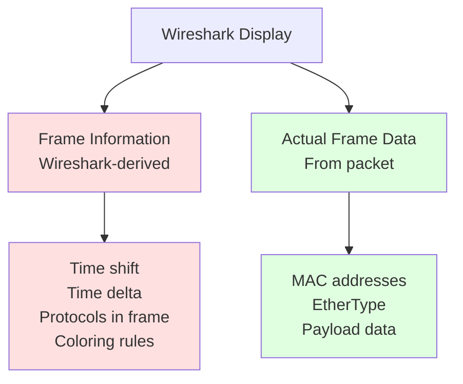
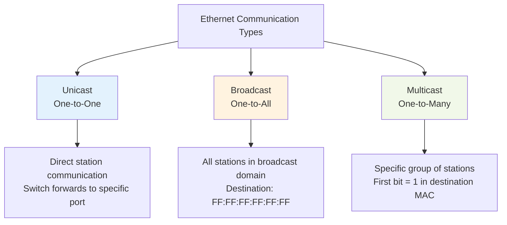
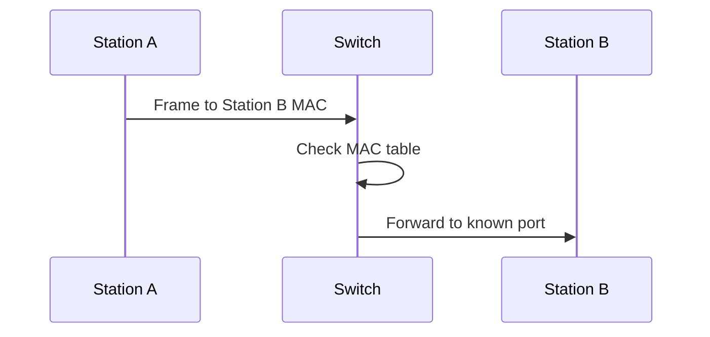
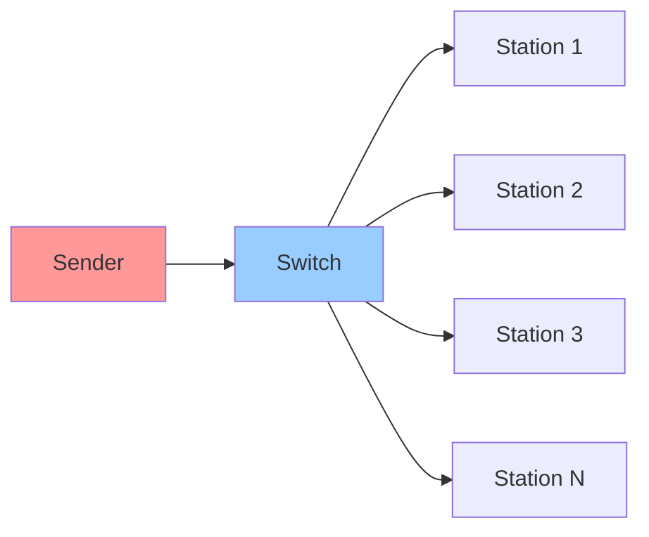
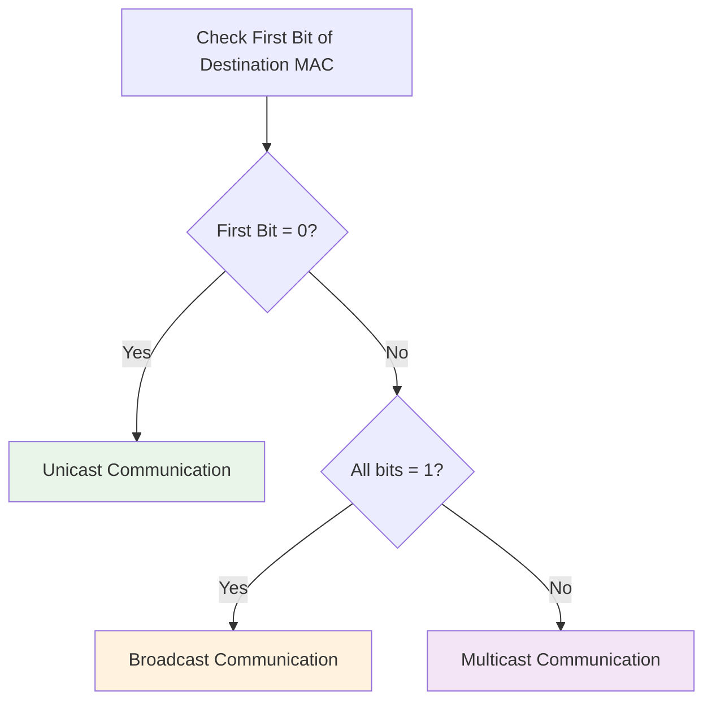
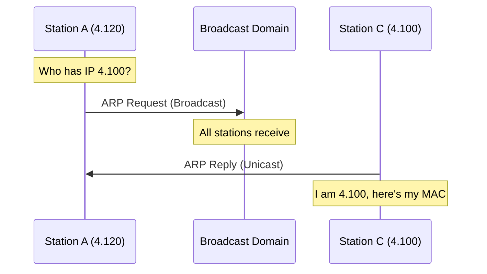

# Fundamentals of Ethernet

*Reference Notes from Wireshark Hands-On Course*

## Table of Contents
- [The Ethernet Frame Structure](#the-ethernet-frame-structure)
- [Frame Check Sequence (FCS)](#frame-check-sequence-fcs)
- [Wireshark Frame Analysis](#wireshark-frame-analysis)
- [Communication Types](#communication-types)
- [Quick Reference](#quick-reference)

---

## The Ethernet Frame Structure

The Ethernet frame is the fundamental unit of data transmission at Layer 2 (Data Link Layer). Understanding its structure is crucial for packet analysis.



### Frame Components

| Field | Size | Purpose | Details |
|-------|------|---------|---------|
| **Destination MAC** | 6 bytes | Target device address | First field in any Ethernet frame |
| **Source MAC** | 6 bytes | Sender device address | Identifies where the frame originated |
| **EtherType** | 2 bytes | Next protocol identifier | Tells Wireshark which dissector to use next |
| **Data** | Variable | Actual payload | Application data, varies by packet type |
| **FCS** | 4 bytes | Frame integrity check | Rarely captured by standard NICs |

### Common EtherType Values



| EtherType | Protocol | Hex Value |
|-----------|----------|-----------|
| IPv4 | Internet Protocol v4 | `0x0800` |
| ARP | Address Resolution Protocol | `0x0806` |
| IPv6 | Internet Protocol v6 | `0x86DD` |

---

## Frame Check Sequence (FCS)

The FCS is a critical error detection mechanism in Ethernet frames.

### How FCS Works



### Key Points about FCS

- **Mathematical Calculation**: Complex equation involving every bit and byte in the frame
- **Error Detection**: Detects transmission errors by comparing calculated vs received values
- **Wireshark Limitation**: Most network interface cards don't capture FCS
- **Specialized Hardware**: Required to see FCS in packet captures

---

## Wireshark Frame Analysis

### Frame Information vs. Actual Data

When analyzing frames in Wireshark, distinguish between:



### Identifying Wireshark-Derived Data

- **Bracketed values**: `[Time shift]`, `[Protocols in frame]` are Wireshark calculations
- **Frame info section**: Contains metadata about the packet
- **Ethernet II section**: Contains actual frame header data

### Enabling MAC Address Resolution

To see manufacturer names (Apple, Cisco) instead of raw MAC addresses:

**Path**: `Edit → Preferences → Name Resolution → Resolve MAC addresses` ✓

---

## Communication Types

Ethernet supports three fundamental communication patterns:


### Troubleshooting Scenarios When Communication Type is Important

ネットワークトラブルシューティングにおいて、Communication Typeを理解することは非常に重要です。以下によくあるIssueの例とその理由を説明します：

#### 1. **トラフィックパターンの異常検出**
- **正常時**: クライアント-サーバー間の適度なUnicast通信
- **問題時**: 異常に多いBroadcast/Multicastトラフィック
- **原因**: ループ、設定ミス、マルウェア感染

#### 2. **パフォーマンス問題の特定**
```
Issue例: ネットワークが突然遅くなった
→ Wiresharkで確認すると大量のBroadcastパケット
→ 原因: DHCPサーバーの故障で端末が継続的にDHCP Discoverを送信
```

#### 3. **セキュリティインシデントの検出**
```
Issue例: 内部ネットワークからの情報漏洩疑い
→ 通常のUnicast通信に混じって異常なMulticastトラフィック
→ 原因: マルウェアがC&Cサーバーとの通信にMulticastを悪用
```

### よくあるトラブルシューティングシナリオ

#### **シナリオ1: ネットワーク輻輳**
- **症状**: 全体的な通信速度低下
- **確認点**: Broadcast/Multicastの割合
- **正常値**: 全トラフィックの5%以下
- **問題値**: 20%以上 → ループやスイッチ故障の可能性

#### **シナリオ2: 特定端末の通信不良**
- **症状**: 1台だけインターネットに接続できない
- **確認点**: その端末のUnicast通信パターン
- **分析**: ARP Request/Replyの流れ、DNS通信の有無

#### **シナリオ3: アプリケーション性能問題**
- **症状**: 特定のアプリケーションだけ遅い
- **確認点**: アプリケーション固有の通信タイプ
- **例**: ビデオ会議 → Multicast使用の有無確認

### Communication Type分析の実践的アプローチ

#### **ステップ1: 全体像把握**
```
Statistics → Protocol Hierarchy
→ 各プロトコルの使用率確認
```

#### **ステップ2: 通信タイプ別分析**
```
Statistics → Conversations
→ Unicast, Broadcast, Multicastの分布確認
```

#### **ステップ3: 異常パターン特定**
```
Filter適用: eth.dst.ig == 1 (Broadcast/Multicast)
→ 異常に多い場合は詳細調査
```

Communication Typeの理解により、ネットワーク問題の根本原因を効率的に特定し、適切な対策を講じることができます。

### Unicast Communication

**One station to another station**

- Most common type of communication
- Switch learns MAC-to-port mapping
- If destination unknown, switch floods to all ports on same VLAN



### Broadcast Communication

**One station to all stations**

- Destination MAC: `FF:FF:FF:FF:FF:FF` (all F's)
- Common with ARP requests
- Reaches all devices in broadcast domain



### Multicast Communication

**One station to many (but not all) stations**

- First bit of destination MAC = 1
- Used by protocols like STP, CDP, LLDP
- Wireshark may show as "IPv4mcast"

---

## Quick Reference

### MAC Address Analysis



### Common Analysis Tasks

1. **Identify Communication Type**
   - Check destination MAC address pattern
   - Look for FF:FF:FF:FF:FF:FF (broadcast)
   - Check first bit for multicast/broadcast vs unicast

2. **Protocol Identification**
   - Examine EtherType field
   - `0x0800` = IPv4, `0x0806` = ARP, `0x86DD` = IPv6

3. **Manufacturer Identification**
   - Enable MAC address resolution in Wireshark
   - Look for OUI (Organizationally Unique Identifier) in first 3 bytes

### ARP Example Analysis

When analyzing ARP traffic:

- **ARP Request**: Usually broadcast (FF:FF:FF:FF:FF:FF)
- **ARP Reply**: Unicast response back to requester
- **Purpose**: Resolve IP address to MAC address mapping



---

## Key Takeaways

1. **Ethernet Frame Structure**: Always starts with destination MAC, followed by source MAC, EtherType, data, and FCS
2. **EtherType Importance**: Determines which protocol Wireshark will parse next
3. **Communication Patterns**: Understand unicast, broadcast, and multicast for proper traffic analysis
4. **Wireshark Features**: Use MAC address resolution and understand the difference between derived and actual data
5. **FCS Limitation**: Most captures won't show FCS due to hardware limitations

*This reference covers the fundamental concepts needed for Ethernet frame analysis in Wireshark.*
