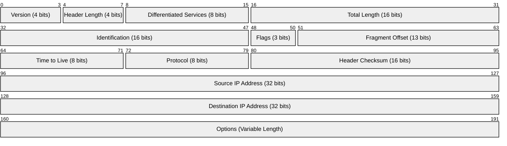

# The Internet Protocol (IP) Header - Reference Guide

## Overview

The Internet Protocol (IP) header is a fundamental component of network communications that sits at Layer 3 (Network Layer) of the OSI model. Understanding the IP header structure is essential for network analysis and troubleshooting with Wireshark.

## IP Header Structure

The IP header contains multiple fields that provide crucial information about packet routing, fragmentation, quality of service, and more.



## Field-by-Field Breakdown

### 1. Version (4 bits)
- **Purpose**: Identifies the IP version being used
- **Common Values**: 
  - `4` = IPv4
  - `6` = IPv6
- **Wireshark Example**: Version 4

### 2. Header Length (4 bits)
- **Purpose**: Specifies the length of the IP header in 32-bit words
- **Common Values**: 
  - `5` = 20 bytes (minimum header size, no options)
  - `6-15` = 24-60 bytes (with options)
- **Wireshark Example**: Header Length is 20 bytes

### 3. Differentiated Services (8 bits)
- **Purpose**: Enables Quality of Service (QoS) and traffic prioritization
- **Components**:
  - **DSCP (Differentiated Services Code Point)**: 6 bits
  - **ECN (Explicit Congestion Notification)**: 2 bits
- **Wireshark Example**: No Codepoint = no prioritization (treat packet normally)

### 4. Total Length (16 bits)
- **Purpose**: Specifies the total length of the IP packet (header + data)
- **Range**: 0-65,535 bytes
- **Note**: Includes both IP header and payload data

### 5. Identification (16 bits)
- **Purpose**: Unique identifier assigned by the sending station for packet identification
- **Usage**: 
  - Helps with fragment reassembly
  - Can be used for traffic analysis and fingerprinting
- **Behavior Patterns**:
  - **Sequential**: Some stations increment by 1 for each packet
  - **Random**: Some stations use random values
  - **Zero**: Some stations use all zeros to avoid fingerprinting

### 6. Flags (3 bits)
- **Bit 0**: Reserved (must be 0)
- **Bit 1**: Don't Fragment (DF)
  - `0` = May fragment
  - `1` = Don't fragment
- **Bit 2**: More Fragments (MF)
  - `0` = Last fragment or unfragmented
  - `1` = More fragments follow

### 7. Fragment Offset (13 bits)
- **Purpose**: Indicates where in the original packet this fragment belongs
- **Units**: 8-byte blocks
- **Usage**: Essential for packet reassembly when fragmentation occurs

### 8. Time to Live (TTL) (8 bits)
- **Purpose**: Limits packet lifetime in the network (hop count, not time)
- **Function**: Decremented by 1 at each router; packet discarded when TTL reaches 0
- **Common Initial Values**:
  - `64` = Linux/Unix systems
  - `128` = Windows systems
  - `255` = Some network devices
- **Wireshark Example**: TTL: 128 (indicating Windows system)

### 9. Protocol (8 bits)
- **Purpose**: Identifies the next layer protocol
- **Common Values**:
  - `1` = ICMP
  - `6` = TCP
  - `17` = UDP
  - `89` = OSPF
- **Wireshark Example**: ICMP

### 10. Header Checksum (16 bits)
- **Purpose**: Error detection for the IP header only
- **Important Note**: Wireshark disables checksum validation by default
- **Reason for Disabled Validation**:
  - Many NICs perform checksum offloading
  - Checksums may be calculated after packet capture
  - Avoiding false negatives in analysis

### 11. Source IP Address (32 bits)
- **Purpose**: IP address of the sending host
- **Format**: 32-bit address (e.g., 192.168.1.1)

### 12. Destination IP Address (32 bits)
- **Purpose**: IP address of the receiving host
- **Format**: 32-bit address (e.g., 192.168.1.100)

### 13. Options (Variable Length)
- **Purpose**: Optional fields for extended functionality
- **Examples**: 
  - Record Route
  - Timestamp
  - Source Route
- **Note**: Rarely used in modern networks

## Practical Analysis Tips

### 1. Identifying Operating Systems
- **TTL Values**: Can help identify the originating OS
  - `64` → Linux/Unix
  - `128` → Windows
  - `255` → Network equipment

### 2. Traffic Flow Analysis
- **IP ID Field**: Monitor for patterns
  - Sequential increments may indicate single source
  - Random values may indicate load balancing or security measures

### 3. Fragmentation Detection
- **Flags and Fragment Offset**: Monitor for fragmentation issues
  - Large packets may cause performance problems
  - Fragmentation can indicate MTU mismatches

### 4. QoS Analysis
- **DSCP Field**: Check for traffic prioritization
  - Voice/video traffic should have appropriate markings
  - Critical applications may need priority treatment

## Wireshark Navigation

### Viewing IP Header Information
1. **Expand the Internet Protocol section** in the packet details pane
2. **Key fields to monitor**:
   - Version and Header Length
   - Total Length (for bandwidth analysis)
   - TTL (for routing analysis)
   - Protocol (for traffic classification)
   - Source/Destination addresses

### Common Display Filters
```
ip.version == 4          # IPv4 packets only
ip.ttl < 10             # Packets with low TTL
ip.flags.df == 1        # Don't Fragment flag set
ip.frag_offset > 0      # Fragmented packets
ip.proto == 1           # ICMP packets
ip.len > 1500           # Large packets
```

## Key Takeaways

1. **The IP header provides essential routing and control information** for packet delivery across networks
2. **TTL values can help identify operating systems** and detect routing loops
3. **Fragmentation flags and offsets** are crucial for understanding packet fragmentation issues
4. **The Protocol field determines the next layer protocol** for proper packet dissection
5. **Checksum validation is disabled by default** in Wireshark to prevent false negatives
6. **IP ID fields can be used for traffic analysis** and detecting patterns in network behavior

## Related Protocols

- **Ethernet**: Layer 2 protocol that encapsulates IP packets
- **ICMP**: Layer 3 protocol for error reporting and diagnostics
- **TCP/UDP**: Layer 4 protocols commonly carried within IP packets
- **ARP**: Protocol for IP-to-MAC address resolution

## Further Study

- Review fragmentation scenarios and their impact on network performance
- Explore DSCP markings and QoS implementations
- Analyze TTL behavior in complex routing scenarios
- Study IP options and their security implications
